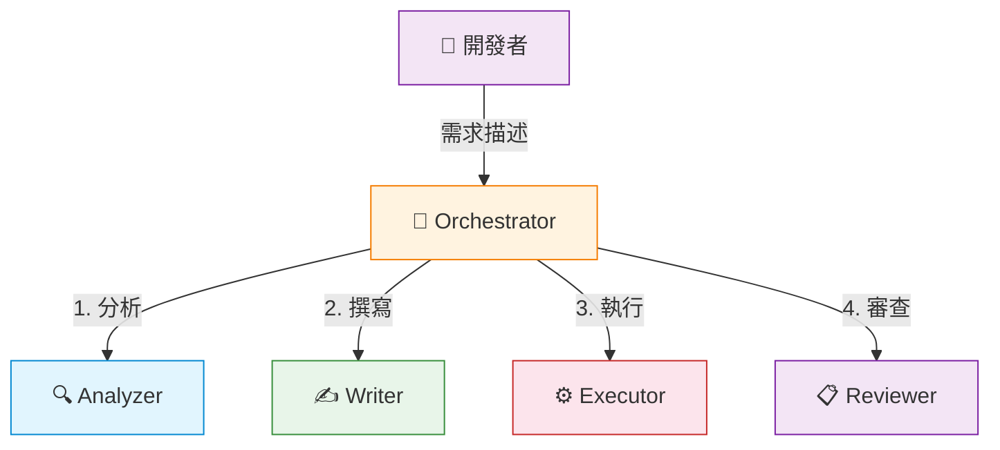

# .NET Testing Agent Orchestration

本工作區發佈與分享四個 **.NET 測試 Agent Orchestrators**，以 **dotnet-testing-agent-skills** 為知識基礎，搭配 GitHub Copilot 的 **Agent Orchestration & Subagents** 功能，依循標準化的 Skills 與製作流程，自動產生具有一定品質的 .NET 測試程式碼。

每個 Orchestrator 採用 1 個指揮者（Orchestrator）+ 4 個專業子代理（Analyzer、Writer、Executor、Reviewer）的分工架構，涵蓋單元測試、整合測試、Aspire 測試與 TUnit 測試四大場景。

---

## 目錄

- [.NET Testing Agent Orchestration](#net-testing-agent-orchestration)
  - [目錄](#目錄)
  - [專案結構](#專案結構)
  - [核心組成](#核心組成)
    - [Agent Orchestrators](#agent-orchestrators)
    - [Agent Skills](#agent-skills)
    - [Custom Prompts](#custom-prompts)
    - [驗證專案](#驗證專案)
  - [快速開始](#快速開始)
    - [前置需求](#前置需求)
    - [VS Code 設定](#vs-code-設定)
    - [操作步驟](#操作步驟)
  - [驗證專案與跨版本支援](#驗證專案與跨版本支援)
  - [還原驗證結果](#還原驗證結果)
  - [操作指南](#操作指南)
  - [文件索引](#文件索引)
    - [Orchestrator 設計文件](#orchestrator-設計文件)
  - [相關專案](#相關專案)
  - [授權](#授權)

---

## 專案結構

```plaintext
dotnet-testing-agent-orchestration/
├── .github/
│   ├── agents/                  # Agent 定義檔（4 Orchestrators + 16 Subagents = 20 個）
│   ├── prompts/                 # GitHub Copilot Custom Prompts（16 個）
│   ├── skills/                  # GitHub Copilot Agent Skills（30 個 + 4 個 OpenSpec）
│   └── copilot-instructions.md  # Repository Custom Instructions
├── docs/
│   ├── agent_orchestration/     # Agent Orchestration 說明與操作指南
│   ├── skills/                  # Agent Skills 說明文件
│   └── prompts/                 # Custom Prompts 說明文件
├── samples/                     # 驗證專案（各含 3 種 .NET 版本）
│   ├── practice/                # 單元測試驗證
│   ├── practice_integration/    # 整合測試驗證
│   ├── practice_aspire/         # Aspire 測試驗證
│   └── practice_tunit/          # TUnit 測試驗證
├── images/                      # 驗證截圖
└── README.md                    # 本檔案
```

---

## 核心組成

### Agent Orchestrators

每個 Orchestrator 採用 **1+4 架構**：1 個 Orchestrator（指揮者）+ 4 個 Subagents（Analyzer、Writer、Executor、Reviewer），涵蓋分析、撰寫、執行、審查的完整工作流程。

| Orchestrator                                       | 測試類型        | Subagents                            | 說明                                      |
| -------------------------------------------------- | --------------- | ------------------------------------ | ----------------------------------------- |
| `dotnet-testing-orchestrator`                      | 單元測試        | analyzer, writer, executor, reviewer | 動態載入 20+ Skills，涵蓋各種單元測試場景 |
| `dotnet-testing-advanced-integration-orchestrator` | 整合測試        | analyzer, writer, executor, reviewer | WebApplicationFactory + Testcontainers    |
| `dotnet-testing-advanced-aspire-orchestrator`      | Aspire 整合測試 | analyzer, writer, executor, reviewer | .NET Aspire Testing 框架                  |
| `dotnet-testing-advanced-tunit-orchestrator`       | TUnit 測試      | analyzer, writer, executor, reviewer | TUnit 新世代測試框架                      |



### Agent Skills

本工作區包含 **dotnet-testing-agent-skills v2.2.0** 的完整技能集合，共 **30 個 Skills**（2 個總覽 + 27 個專業 + 1 個第三方），分為五大階段：

| 階段           | 內容                                                   | 技能數量 |
| -------------- | ------------------------------------------------------ | -------- |
| 基礎測試與斷言 | 單元測試基礎、命名規範、xUnit 設定、斷言、Mock、覆蓋率 | 10       |
| 可測試性抽象化 | TimeProvider、System.IO.Abstractions                   | 2        |
| 測試資料生成   | AutoFixture、Bogus、Test Data Builder、AutoData        | 7        |
| 整合測試       | ASP.NET Core、Testcontainers、Web API、.NET Aspire     | 5        |
| 框架遷移       | xUnit v2→v3 升級、TUnit 新世代框架                     | 3        |

> Skills 來源：[kevintsengtw/dotnet-testing-agent-skills](https://github.com/kevintsengtw/dotnet-testing-agent-skills)

### Custom Prompts

共 **16 個** Custom Prompts，每個 Prompt 預先組合相關 Agent Skills，提供特定場景的測試指導：

| 分類             | Prompts                                                                                          |
| ---------------- | ------------------------------------------------------------------------------------------------ |
| 基礎測試         | `dotnet-testing-fundamentals`                                                                    |
| 斷言與驗證       | `dotnet-testing-assertions`                                                                      |
| Mock 與依賴隔離  | `dotnet-testing-nsubstitute-mocking`                                                             |
| 可測試性抽象化   | `dotnet-testing-datetime-testing-timeprovider`、`dotnet-testing-filesystem-testing-abstractions` |
| 測試資料生成     | `dotnet-testing-test-data-builder`、`dotnet-testing-autofixture-bogus`                           |
| 測試輸出與覆蓋率 | `dotnet-testing-test-output-logging`、`dotnet-testing-code-coverage-analysis`                    |
| 特殊場景         | `dotnet-testing-private-internal-testing`、`dotnet-testing-fluentvalidation-testing`             |
| 整合測試         | `dotnet-testing-advanced-integration`、`dotnet-testing-advanced-testcontainers`                  |
| Aspire 測試      | `dotnet-testing-advanced-aspire-testing`                                                         |
| TUnit 測試       | `dotnet-testing-advanced-tunit`                                                                  |
| 框架遷移         | `dotnet-testing-advanced-xunit-upgrade`                                                          |

### 驗證專案

四組驗證專案使用不同的業務領域，避免與既有範例重疊。測試專案（`tests/`）僅包含空的 `.csproj`，測試程式碼完全由 Orchestrator 從零產生。

| 驗證專案                        | 業務領域                               | 測試框架                                       |
| ------------------------------- | -------------------------------------- | ---------------------------------------------- |
| `samples/practice/`             | 多領域（溫度轉換、天氣、訂單、員工等） | xUnit                                          |
| `samples/practice_integration/` | 訂單管理（Orders）                     | xUnit + WebApplicationFactory + Testcontainers |
| `samples/practice_aspire/`      | 預約管理（Bookings）                   | xUnit + Aspire Testing                         |
| `samples/practice_tunit/`       | 圖書館管理（Library）                  | TUnit                                          |

---

## 快速開始

### 前置需求

| 項目                | 要求                                                   |
| ------------------- | ------------------------------------------------------ |
| **VS Code**         | 1.109 以上，已安裝 GitHub Copilot Chat                 |
| **GitHub Copilot**  | Individual / Business / Enterprise 方案                |
| **.NET SDK**        | 依據目標版本安裝 .NET 8 / 9 / 10 SDK                   |
| **Docker Desktop**  | 整合測試與 Aspire 測試需要（單元測試與 TUnit 不需要）  |
| **Aspire Workload** | 僅 Aspire 測試需要（`dotnet workload install aspire`） |

### VS Code 設定

```json
{
  "chat.customAgentInSubagent.enabled": true,
  "github.copilot.chat.responsesApiReasoningEffort": "high",
  "chat.agentFilesLocations": {
    "${workspaceFolder}/.github/agents": true
  }
}
```

### 操作步驟

1. 在 VS Code 中開啟本工作區
2. 開啟 Copilot Chat 面板（`Ctrl+Alt+I`）
3. 將模式切換為 **Agent**
4. 從 Agent 下拉選單選擇目標 Orchestrator
5. 使用 `#file:` 引用目標檔案，或直接描述測試目標

```text
# 範例：單元測試
@dotnet-testing-orchestrator #file:practice/src/Practice.Core/Services/WeatherAlertService.cs 幫這個服務寫測試

# 範例：整合測試
@dotnet-testing-advanced-integration-orchestrator #file:practice_integration/src/Practice.Integration.WebApi/Controllers/OrdersController.cs 測試所有 CRUD 端點
```

---

## 驗證專案與跨版本支援

每組驗證專案提供三種 .NET 版本，透過獨立的 `.slnx` 檔案管理：

| .slnx 後綴 | .NET 版本 | 說明       |
| ---------- | --------- | ---------- |
| （無後綴） | net9.0    | 基線版本   |
| `.Net8`    | net8.0    | 跨版本驗證 |
| `.Net10`   | net10.0   | 跨版本驗證 |

以單元測試為例：

| 版本         | .slnx                         | 來源專案路徑                        |
| ------------ | ----------------------------- | ----------------------------------- |
| **.NET 9.0** | `Practice.Samples.slnx`       | `practice/src/Practice.Core/`       |
| .NET 8.0     | `Practice.Samples.Net8.slnx`  | `practice/src/Practice.Core.Net8/`  |
| .NET 10.0    | `Practice.Samples.Net10.slnx` | `practice/src/Practice.Core.Net10/` |

> 驗證其他版本時，將 `#file:` 路徑替換為對應版本的專案路徑即可。

---

## 還原驗證結果

Orchestrator 會在 `tests/` 目錄下產生測試程式碼。驗證完成後，可使用以下方式還原：

```powershell
# 還原單一驗證專案
git restore samples/practice/tests/
git clean -fd samples/practice/tests/

# 還原所有驗證專案
git restore samples/
git clean -fd samples/
```

---

## 操作指南

各 Orchestrator 的詳細操作步驟與驗證情境：

| 指南                                                                                                    | 說明                                |
| ------------------------------------------------------------------------------------------------------- | ----------------------------------- |
| [practice-guide.md](docs/agent_orchestration/practice-guide.md)                                         | 總覽與環境準備                      |
| [practice-guide-unit-testing.md](docs/agent_orchestration/practice-guide-unit-testing.md)               | 單元測試操作指南（11 個驗證情境）   |
| [practice-guide-integration-testing.md](docs/agent_orchestration/practice-guide-integration-testing.md) | 整合測試操作指南（3 個驗證情境）    |
| [practice-guide-aspire-testing.md](docs/agent_orchestration/practice-guide-aspire-testing.md)           | Aspire 測試操作指南（2 個驗證情境） |
| [practice-guide-tunit-testing.md](docs/agent_orchestration/practice-guide-tunit-testing.md)             | TUnit 測試操作指南（7 個驗證情境）  |

---

## 文件索引

| 文件                                                                     | 說明                                                 |
| ------------------------------------------------------------------------ | ---------------------------------------------------- |
| [docs/agent_orchestration/README.md](docs/agent_orchestration/README.md) | Agent Orchestration 完整說明（概念、架構、建置方式） |
| [docs/skills/README.md](docs/skills/README.md)                           | Agent Skills 列表與說明                              |
| [docs/prompts/README.md](docs/prompts/README.md)                         | Custom Prompts 清單與功能說明                        |
| [samples/README.md](samples/README.md)                                   | 驗證專案結構與使用方式                               |
| [.github/copilot-instructions.md](.github/copilot-instructions.md)       | Repository Custom Instructions                       |

### Orchestrator 設計文件

| 文件                                                                                                                                | 說明                          |
| ----------------------------------------------------------------------------------------------------------------------------------- | ----------------------------- |
| [dotnet-testing-orchestrator.md](docs/agent_orchestration/dotnet-testing-orchestrator.md)                                           | 單元測試 Orchestrator 設計    |
| [dotnet-testing-advanced-integration-orchestrator.md](docs/agent_orchestration/dotnet-testing-advanced-integration-orchestrator.md) | 整合測試 Orchestrator 設計    |
| [dotnet-testing-advanced-aspire-orchestrator.md](docs/agent_orchestration/dotnet-testing-advanced-aspire-orchestrator.md)           | Aspire 測試 Orchestrator 設計 |
| [dotnet-testing-advanced-tunit-orchestrator.md](docs/agent_orchestration/dotnet-testing-advanced-tunit-orchestrator.md)             | TUnit 測試 Orchestrator 設計  |

---

## 相關專案

| 專案                                                                                       | 說明                                       |
| ------------------------------------------------------------------------------------------ | ------------------------------------------ |
| [dotnet-testing-agent-skills](https://github.com/kevintsengtw/dotnet-testing-agent-skills) | .NET Testing Agent Skills 原始碼（v2.2.0） |

---

## 授權

MIT License
