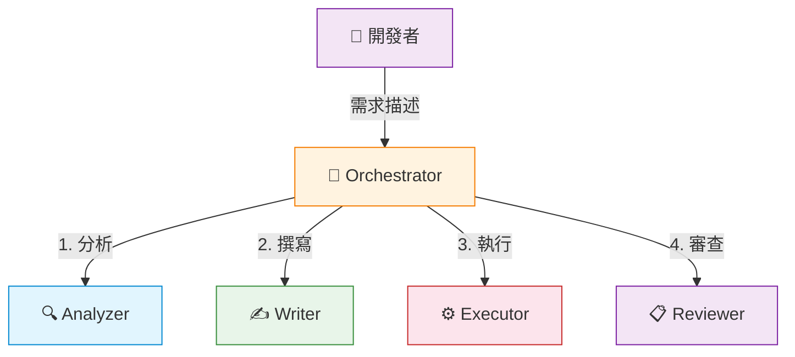
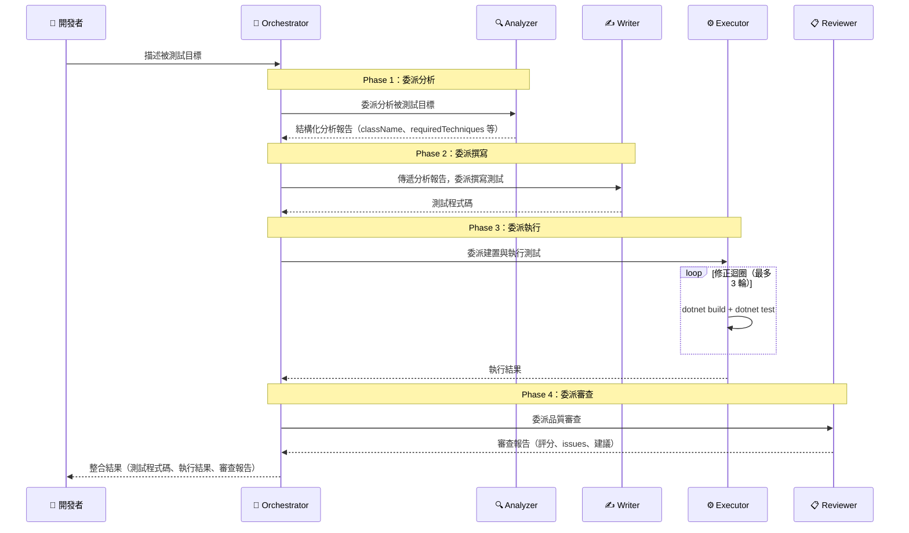

# .NET Testing Agent Orchestration

本工作區發佈與分享四個 **.NET 測試 Agent Orchestrators**，以 **dotnet-testing-agent-skills** 為知識基礎，搭配 GitHub Copilot 的 **Agent Orchestration & Subagents** 功能，依循標準化的 Skills 與製作流程，自動產生具有一定品質的 .NET 測試程式碼。

每個 Orchestrator 採用 1 個指揮者（Orchestrator）+ 4 個專業子代理（Analyzer、Writer、Executor、Reviewer）的分工架構，涵蓋單元測試、整合測試、Aspire 測試與 TUnit 測試四大場景。

---

## 目錄

- [.NET Testing Agent Orchestration](#net-testing-agent-orchestration)
  - [目錄](#目錄)
  - [專案結構](#專案結構)
  - [核心組成](#核心組成)
    - [Agent Orchestrators](#agent-orchestrators)
    - [Agent Skills](#agent-skills)
    - [驗證專案](#驗證專案)
  - [快速開始](#快速開始)
    - [前置需求](#前置需求)
    - [VS Code 設定](#vs-code-設定)
    - [mcp-local-rag 設定](#mcp-local-rag-設定)
      - [步驟一：clone dotnet-testing-agent-skills](#步驟一clone-dotnet-testing-agent-skills)
      - [步驟二：安裝 mcp-local-rag 並建立索引](#步驟二安裝-mcp-local-rag-並建立索引)
      - [步驟三：建立 `.vscode/mcp.json`](#步驟三建立-vscodemcpjson)
    - [操作步驟](#操作步驟)
  - [驗證專案與跨版本支援](#驗證專案與跨版本支援)
  - [還原驗證結果](#還原驗證結果)
  - [操作指南](#操作指南)
  - [文件索引](#文件索引)
    - [Orchestrator 設計文件](#orchestrator-設計文件)
  - [相關專案](#相關專案)
  - [授權](#授權)

---

## 專案結構

```plaintext
dotnet-testing-agent-orchestration/
├── .github/
│   ├── agents/                  # Agent 定義檔（4 Orchestrators + 16 Subagents = 20 個）
│   ├── skills/                  # GitHub Copilot Agent Skills（dotnet-test 測試執行器）
│   └── copilot-instructions.md  # Repository Custom Instructions
├── docs/
│   ├── agent_orchestration/     # Agent Orchestration 說明與操作指南
│   ├── mcp_local_rag/           # mcp-local-rag 安裝、索引與排查文件
│   ├── skills/                  # Agent Skills 說明文件
│   └── v2_0_0/                  # v2.0.0 發佈、升級與故障排查文件
├── samples/                     # 驗證專案（各含 3 種 .NET 版本）
│   ├── practice/                # 單元測試驗證
│   ├── practice_integration/    # 整合測試驗證
│   ├── practice_aspire/         # Aspire 測試驗證
│   └── practice_tunit/          # TUnit 測試驗證
├── images/                      # 驗證截圖
└── README.md                    # 本檔案
```

---

## 核心組成

### Agent Orchestrators

每個 Orchestrator 採用 **1+4 架構**：1 個 Orchestrator（指揮者）+ 4 個 Subagents（Analyzer、Writer、Executor、Reviewer），涵蓋分析、撰寫、執行、審查的完整工作流程。

| Orchestrator                                       | 測試類型        | Subagents                            | 說明                                      |
| -------------------------------------------------- | --------------- | ------------------------------------ | ----------------------------------------- |
| `dotnet-testing-orchestrator`                      | 單元測試        | analyzer, writer, executor, reviewer | 動態載入 20+ Skills，涵蓋各種單元測試場景 |
| `dotnet-testing-advanced-integration-orchestrator` | 整合測試        | analyzer, writer, executor, reviewer | WebApplicationFactory + Testcontainers    |
| `dotnet-testing-advanced-aspire-orchestrator`      | Aspire 整合測試 | analyzer, writer, executor, reviewer | .NET Aspire Testing 框架                  |
| `dotnet-testing-advanced-tunit-orchestrator`       | TUnit 測試      | analyzer, writer, executor, reviewer | TUnit 新世代測試框架                      |



工作流程依四個階段依序執行，各階段由對應 Subagent 負責並將結果回傳 Orchestrator：



### Agent Skills

本工作區的 Agent Orchestrators 以 **[dotnet-testing-agent-skills](https://github.com/kevintsengtw/dotnet-testing-agent-skills)** 為知識來源，涵蓋共 **29 個 Skills**，分為五大類別：

| 類別           | 內容                                                   | 技能數量 |
| -------------- | ------------------------------------------------------ | -------- |
| 基礎測試與斷言 | 單元測試基礎、命名規範、xUnit 設定、斷言、Mock、覆蓋率 | 10       |
| 可測試性抽象化 | TimeProvider、System.IO.Abstractions                   | 2        |
| 測試資料生成   | AutoFixture、Bogus、Test Data Builder、AutoData        | 7        |
| 整合測試       | ASP.NET Core、Testcontainers、Web API、.NET Aspire     | 5        |
| 框架遷移       | xUnit v2→v3 升級、TUnit 新世代框架                     | 3        |

Skills 內容由 `dotnet-testing-agent-skills` 統一維護，使用者需另行 clone 該倉庫並建立 mcp-local-rag 索引庫，GitHub Copilot 的 Writer / Reviewer 才能透過語意查詢取用技能知識。詳見[前置需求](#前置需求)。

### 驗證專案

四組驗證專案使用不同的業務領域，避免與既有範例重疊。測試專案（`tests/`）僅包含空的 `.csproj`，測試程式碼完全由 Orchestrator 從零產生。

| 驗證專案                        | 業務領域                               | 測試框架                                       |
| ------------------------------- | -------------------------------------- | ---------------------------------------------- |
| `samples/practice/`             | 多領域（溫度轉換、天氣、訂單、員工等） | xUnit                                          |
| `samples/practice_integration/` | 訂單管理（Orders）                     | xUnit + WebApplicationFactory + Testcontainers |
| `samples/practice_aspire/`      | 預約管理（Bookings）                   | xUnit + Aspire Testing                         |
| `samples/practice_tunit/`       | 圖書館管理（Library）                  | TUnit                                          |

---

## 快速開始

### 前置需求

| 項目                              | 要求                       | 說明                                                   |
| --------------------------------- | -------------------------- | ------------------------------------------------------ |
| **VS Code**                       | 1.111 以上                 | 需支援 Agent Autopilot 與 Custom Agents / Subagents    |
| **GitHub Copilot Chat**           | 已安裝                     | Individual / Business / Enterprise 方案                |
| **dotnet-testing-agent-skills**   | clone 至本機               | mcp-local-rag 技能索引來源，見下方 mcp-local-rag 設定  |
| **Node.js**                       | 18 以上                    | mcp-local-rag 必要前置                                 |
| **mcp-local-rag**                 | npm install -g             | GitHub Copilot 技能查詢 MCP server，見下方設定說明     |
| **.NET SDK**                      | 8 / 9 / 10                 | 依據目標版本安裝                                       |
| **Docker Desktop**                | Integration / Aspire 適用  | 整合測試與 Aspire 測試需要（單元測試與 TUnit 不需要）  |
| **Aspire Workload**               | Aspire 適用                | 僅 Aspire 測試需要（`dotnet workload install aspire`） |

### VS Code 設定

```json
{
  "chat.customAgentInSubagent.enabled": true,
  "github.copilot.chat.responsesApiReasoningEffort": "high",
  "chat.agentFilesLocations": {
    "${workspaceFolder}/.github/agents": true
  },
  "github.copilot.chat.agent.autopilot.enabled": true
}
```

啟用 **Autopilot**（VS Code 1.111+）後，多階段 Agent Orchestration 工作流程可自動完成各 subagent 之間的確認步驟，減少手動介入。詳見 [VS Code 1.111 Release Notes](https://code.visualstudio.com/updates/v1_111)。

若需要檢視 orchestration 的執行過程與各階段交接內容，可在 Copilot Chat 中開啟 **Agent Debug Panel**（VS Code 1.110+）。其中的 **Agent Flow Chart view** 可以視覺化呈現 `dotnet-testing-orchestrator` 的執行流程，讓使用者清楚看到各 Subagent（Analyzer、Writer、Executor、Reviewer）的執行狀態與交接過程。詳見 [VS Code 1.110 Release Notes](https://code.visualstudio.com/updates/v1_110) 與 [Agent Debug View 文件](https://code.visualstudio.com/docs/copilot/chat/chat-debug-view)。

### mcp-local-rag 設定

mcp-local-rag 是 GitHub Copilot 的技能查詢 MCP server，為 v2.0.0 的必要前置。Writer 與 Reviewer subagents 透過它進行語意搜尋，取代逐一讀取 SKILL.md 的高成本方式。

#### 步驟一：clone dotnet-testing-agent-skills

```bash
git clone https://github.com/kevintsengtw/dotnet-testing-agent-skills.git
```

#### 步驟二：安裝 mcp-local-rag 並建立索引

Windows（PowerShell）：

```powershell
npm install -g mcp-local-rag
.\docs\mcp_local_rag\scripts\mcp-local-rag-index-skills.ps1 -SkillsPath C:\projects\dotnet-testing-agent-skills\.github\skills
```

macOS / Linux：

```bash
npm install -g mcp-local-rag
python docs/mcp_local_rag/scripts/mcp-local-rag-index-skills.py --skills-path /path/to/dotnet-testing-agent-skills/.github/skills
```

#### 步驟三：建立 `.vscode/mcp.json`

```json
{
  "servers": {
    "dotnet-testing-skills": {
      "command": "npx",
      "args": ["-y", "mcp-local-rag"],
      "env": {
        "BASE_DIR": "/path/to/dotnet-testing-agent-skills/.github/skills",
        "DB_PATH": "${workspaceFolder}/.mcp/dotnet-testing-skills",
        "CACHE_DIR": "${workspaceFolder}/.mcp/cache",
        "RAG_HYBRID_WEIGHT": "0.7",
        "RAG_GROUPING": "similar"
      }
    }
  }
}
```

> `BASE_DIR` 為設定範例值，請依 [docs/mcp_local_rag/README.md](docs/mcp_local_rag/README.md) 的流程建立與驗證設定，通常不需要手動修改為本機 repo 路徑。

### 操作步驟

1. 在 VS Code 中開啟本工作區
2. 開啟 Copilot Chat 面板（`Ctrl+Alt+I`）
3. 將模式切換為 **Agent**
4. 從 Agent 下拉選單選擇目標 Orchestrator（例如 `dotnet-testing-orchestrator` 或 `dotnet-testing-advanced-integration-orchestrator`）
5. 直接在 Chat 輸入測試需求

範例提示詞（單元測試）：

```text
測試專案: practice/src/Practice.Core
測試目標: practice/src/Practice.Core/Services/WeatherAlertService.cs
建立 WeatherAlertService 類別的單元測試
```

範例提示詞（整合測試）：

```text
測試專案: practice_integration/src/Practice.Integration.WebApi
測試目標: practice_integration/src/Practice.Integration.WebApi/Controllers/OrdersController.cs
建立 OrdersController 所有 CRUD 端點的整合測試
```

> 注意：dotnet-testing-agent-orchestration 測試工作流程必須在 VS Code Copilot Chat Panel（Agent 模式）中執行，**不支援 Copilot CLI**。

---

## 驗證專案與跨版本支援

每組驗證專案提供三種 .NET 版本，透過獨立的 `.slnx` 檔案管理：

| .slnx 後綴 | .NET 版本 | 說明       |
| ---------- | --------- | ---------- |
| （無後綴） | net9.0    | 基線版本   |
| `.Net8`    | net8.0    | 跨版本驗證 |
| `.Net10`   | net10.0   | 跨版本驗證 |

以單元測試為例：

| 版本         | .slnx                         | 來源專案路徑                        |
| ------------ | ----------------------------- | ----------------------------------- |
| **.NET 9.0** | `Practice.Samples.slnx`       | `practice/src/Practice.Core/`       |
| .NET 8.0     | `Practice.Samples.Net8.slnx`  | `practice/src/Practice.Core.Net8/`  |
| .NET 10.0    | `Practice.Samples.Net10.slnx` | `practice/src/Practice.Core.Net10/` |

> 驗證其他版本時，將 `#file:` 路徑替換為對應版本的專案路徑即可。

---

## 還原驗證結果

Orchestrator 會在 `tests/` 目錄下產生測試程式碼。驗證完成後，可使用以下方式還原：

```powershell
# 還原單一驗證專案
git restore samples/practice/tests/
git clean -fd samples/practice/tests/

# 還原所有驗證專案
git restore samples/
git clean -fd samples/
```

---

## 操作指南

各 Orchestrator 的詳細操作步驟與驗證情境：

| 指南                                                                                                    | 說明                                |
| ------------------------------------------------------------------------------------------------------- | ----------------------------------- |
| [practice-guide.md](docs/agent_orchestration/practice-guide.md)                                         | 總覽與環境準備                      |
| [practice-guide-unit-testing.md](docs/agent_orchestration/practice-guide-unit-testing.md)               | 單元測試操作指南（11 個驗證情境）   |
| [practice-guide-integration-testing.md](docs/agent_orchestration/practice-guide-integration-testing.md) | 整合測試操作指南（3 個驗證情境）    |
| [practice-guide-aspire-testing.md](docs/agent_orchestration/practice-guide-aspire-testing.md)           | Aspire 測試操作指南（2 個驗證情境） |
| [practice-guide-tunit-testing.md](docs/agent_orchestration/practice-guide-tunit-testing.md)             | TUnit 測試操作指南（7 個驗證情境）  |

---

## 文件索引

| 文件                                                                     | 說明                                                 |
| ------------------------------------------------------------------------ | ---------------------------------------------------- |
| [docs/agent_orchestration/README.md](docs/agent_orchestration/README.md) | Agent Orchestration 完整說明（概念、架構、建置方式） |
| [docs/mcp_local_rag/README.md](docs/mcp_local_rag/README.md)             | mcp-local-rag 安裝、索引建立、驗證與排查             |
| [docs/v2_0_0/README.md](docs/v2_0_0/README.md)                           | v2.0.0 發佈、升級與故障排查文件                      |
| [docs/skills/README.md](docs/skills/README.md)                           | Agent Skills 列表與說明                              |
| [samples/README.md](samples/README.md)                                   | 驗證專案結構與使用方式                               |
| [.github/copilot-instructions.md](.github/copilot-instructions.md)       | Repository Custom Instructions                       |

### Orchestrator 設計文件

| 文件                                                                                                                                | 說明                          |
| ----------------------------------------------------------------------------------------------------------------------------------- | ----------------------------- |
| [dotnet-testing-orchestrator.md](docs/agent_orchestration/dotnet-testing-orchestrator.md)                                           | 單元測試 Orchestrator 設計    |
| [dotnet-testing-advanced-integration-orchestrator.md](docs/agent_orchestration/dotnet-testing-advanced-integration-orchestrator.md) | 整合測試 Orchestrator 設計    |
| [dotnet-testing-advanced-aspire-orchestrator.md](docs/agent_orchestration/dotnet-testing-advanced-aspire-orchestrator.md)           | Aspire 測試 Orchestrator 設計 |
| [dotnet-testing-advanced-tunit-orchestrator.md](docs/agent_orchestration/dotnet-testing-advanced-tunit-orchestrator.md)             | TUnit 測試 Orchestrator 設計  |

---

## 相關專案

| 專案                                                                                       | 說明                                       |
| ------------------------------------------------------------------------------------------ | ------------------------------------------ |
| [dotnet-testing-agent-skills](https://github.com/kevintsengtw/dotnet-testing-agent-skills) | .NET Testing Agent Skills 原始碼（v2.4.1） |

---

## 授權

MIT License
