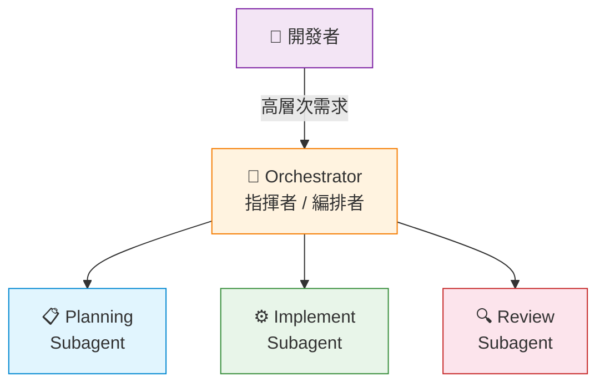
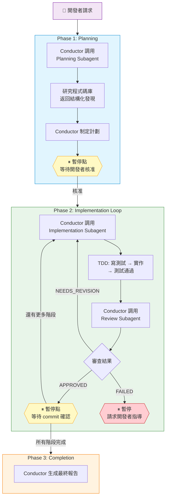

# Agent Orchestration 與 Subagents

- [Agent Orchestration 與 Subagents](#agent-orchestration-與-subagents)
  - [什麼是 Agent Orchestration](#什麼是-agent-orchestration)
  - [為什麼需要 Agent Orchestration](#為什麼需要-agent-orchestration)
    - [上下文管理](#上下文管理)
    - [品質保證系統化](#品質保證系統化)
    - [工作流程自動化](#工作流程自動化)
  - [核心概念](#核心概念)
    - [Orchestrator（指揮者）](#orchestrator指揮者)
    - [Subagent（子代理）](#subagent子代理)
    - [Handoff（交接）](#handoff交接)
  - [指揮者-執行者模式](#指揮者-執行者模式)
  - [典型工作流程](#典型工作流程)
  - [如何建立 Agent Orchestrator](#如何建立-agent-orchestrator)
    - [.agent.md 檔案結構](#agentmd-檔案結構)
    - [YAML Frontmatter 欄位說明](#yaml-frontmatter-欄位說明)
    - [Tools 常用工具](#tools-常用工具)
    - [Model Fallback 配置](#model-fallback-配置)
    - [控制 Agent 可見性](#控制-agent-可見性)
    - [Tools 配置建議](#tools-配置建議)
    - [Body 撰寫要點](#body-撰寫要點)
  - [4-Agent 模式](#4-agent-模式)
  - [本工作區的 Agent Orchestrators](#本工作區的-agent-orchestrators)
  - [Agent Skills 與 Agent Orchestration 的關係](#agent-skills-與-agent-orchestration-的關係)
  - [啟用設定](#啟用設定)
    - [前置需求](#前置需求)
    - [VS Code 設定](#vs-code-設定)
    - [驗證](#驗證)
  - [參考資源](#參考資源)

## 什麼是 Agent Orchestration

**Agent Orchestration**（代理編排）是一種軟體架構模式，由一個主要代理（**Orchestrator**）負責協調多個專業化子代理（**Subagents**），共同完成複雜的任務。

這是從「一個 AI 助手」到「一個 AI 團隊」的模式轉移。

> 類比：就像一個交響樂團——指揮家（Orchestrator）不親自演奏樂器，而是指揮小提琴手、鋼琴手、長笛手等專業樂手（Subagents）協同演奏，創造出完整的作品。



---

## 為什麼需要 Agent Orchestration

### 上下文管理

在大型專案中，AI 需要同時理解專案架構、程式碼慣例、測試策略和業務邏輯。所有資訊塞進單一對話，很快就會超過上下文視窗限制。

透過專業化分工，每個 agent 只關注它負責的部分：

- **研究型 agents**：讀取大量檔案，返回精簡摘要
- **實作型 agents**：只載入需要修改的檔案
- **審查型 agents**：只讀取變更的部分

### 品質保證系統化

傳統對話式互動中，是否進行測試、是否審查程式碼，完全取決於開發者是否記得詢問。Agent Orchestration 將品質保證內建為流程的一部分。

### 工作流程自動化

預先定義好的 agents 已內建最佳實踐，開發者只需描述需求，agent 團隊自動依序完成規劃、實作、審查。

---

## 核心概念

### Orchestrator（指揮者）

統籌全局的主要 agent。職責包括：

- 接收開發者的高層次需求
- 分解任務為可執行的步驟
- 委派任務給適當的 subagent
- 整合 subagents 的輸出
- 與開發者互動（報告進度、請求確認）

技術實現：透過 `agent` tool 調用其他 subagents。

### Subagent（子代理）

執行特定類型任務的專業化 agent。由 Orchestrator 調用，不直接與開發者互動。

關鍵特性：**每個 subagent 有獨立的 context window**，不佔用主 agent 的上下文額度。

> **重要**：Subagent 不會繼承主 agent 的指令和對話歷史，它從乾淨的 context 開始執行。因此，Orchestrator 在調用 subagent 時必須**明確傳遞所需的上下文資訊**。

常見類型：

| 類型               | 職責       | 典型工具                                 |
| ------------------ | ---------- | ---------------------------------------- |
| **Planning**       | 研究與規劃 | `search`, `problems`, `changes`, `fetch` |
| **Implementation** | 程式碼撰寫 | `search`, `edit`, `runCommands`          |
| **Review**         | 品質審查   | `search`, `problems`, `changes`          |
| **Explorer**       | 快速探索   | `search`, `usages`                       |

### Handoff（交接）

Agent 完成任務後建議下一步的機制。在 UI 以按鈕形式呈現，使用者可一鍵切換到下一個 agent。

```yaml
handoffs:
  - label: Start Implementation      # UI 按鈕文字
    agent: implement-subagent         # 目標 agent
    prompt: Implement the plan.       # 交接時的提示詞
    send: false                       # false = 使用者手動送出（預設）
```

> Handoffs 是使用者層級的「流程銜接」；subagents 是系統層級的「任務委派」。Handoffs 需要使用者點擊按鈕，subagents 由 agent 自動調用。

---

## 指揮者-執行者模式

Agent Orchestration 的核心是 **Conductor-Delegate Pattern**（VS Code 官方稱為 **Coordinator & Worker Pattern**）。

模式特點：

1. **階層式控制**：Orchestrator 是唯一與開發者直接互動的 agent
2. **單一職責原則**：每個 agent 專注一項任務
3. **可控性**：透過 `agents` 欄位限制可調用的 subagents
4. **並行執行**：支援獨立任務同時在多個 subagents 中執行
5. **故障隔離**：單一 subagent 失敗不影響整體系統

---

## 典型工作流程



**暫停點**確保開發者始終保持控制：

- **計劃核准**：確認計劃符合需求後再開始實作
- **階段提交**：每個階段審查通過後，開發者執行 git commit 再進入下一階段

---

## 如何建立 Agent Orchestrator

### .agent.md 檔案結構

每個 agent 定義為一個 `.agent.md` 檔案，放置於 `.github/agents/` 目錄中。檔案由兩部分組成：**YAML Frontmatter**（配置）和 **Body**（指令內容）。

````markdown
---
name: my-agent
description: 'Agent 的簡短描述'
argument-hint: '提示使用者輸入什麼'
tools: ['search', 'edit', 'runCommands', 'agent']
model: Claude Sonnet 4.5 (copilot)
agents: ['planning-subagent', 'implement-subagent']
user-invokable: true
handoffs:
  - label: '交接按鈕文字'
    agent: 目標agent名稱
    prompt: '交接時的提示詞'
---

你是一個 [角色定義]。你的職責是...

<workflow>
工作流程步驟
</workflow>

<guidelines>
執行準則
</guidelines>
````

### YAML Frontmatter 欄位說明

| 欄位                       | 說明                                                     | 必要性          |
| -------------------------- | -------------------------------------------------------- | --------------- |
| `name`                     | Agent 名稱（未指定則使用檔名）                           | 選填            |
| `description`              | 顯示在 UI 的描述                                         | 建議填寫        |
| `argument-hint`            | 提示使用者輸入的佔位文字                                 | 選填            |
| `tools`                    | 可用工具清單                                             | 建議填寫        |
| `model`                    | AI 模型（字串或陣列，陣列可設 fallback）                 | 選填            |
| `agents`                   | 可調用的 subagent 清單（`["*"]` = 全部）                 | Orchestrator 用 |
| `user-invokable`           | 是否顯示在 agents 下拉選單（預設 `true`）                | 選填            |
| `disable-model-invocation` | 是否防止被其他 agent 自動調用為 subagent（預設 `false`） | 選填            |
| `handoffs`                 | 交接設定陣列                                             | 選填            |

### Tools 常用工具

| 工具          | 功能                 | 使用場景               |
| ------------- | -------------------- | ---------------------- |
| `search`      | 語義搜尋程式碼庫     | 找出相關檔案和函數     |
| `edit`        | 建立 / 修改檔案      | 實作程式碼變更         |
| `runCommands` | 執行終端機命令       | 安裝套件、執行測試     |
| `agent`       | 調用子代理           | Orchestrator 專用      |
| `usages`      | 找出程式碼使用情況   | 了解函數在哪裡被呼叫   |
| `problems`    | 取得錯誤和警告       | 診斷編譯錯誤           |
| `changes`     | 取得 Git 變更        | 審查修改內容           |
| `testFailure` | 取得測試失敗詳情     | 診斷測試問題           |
| `todos`       | 管理待辦事項         | 追蹤任務進度           |

> **重要**：調用 subagent 的工具名稱是 **`agent`**，不是 `runSubagent`。

### Model Fallback 配置

```yaml
# 單一模型
model: Claude Sonnet 4.5 (copilot)

# Fallback 模型列表（依序嘗試）
model:
  - Claude Sonnet 4.5 (copilot)
  - GPT-5 (copilot)
```

### 控制 Agent 可見性

| Agent             | `user-invokable` | `disable-model-invocation` | 行為                           |
| ----------------- | ---------------- | -------------------------- | ------------------------------ |
| Orchestrator      | `true`           | `false`                    | 使用者在選單中選擇，也可被調用 |
| Planning-subagent | `false`          | `false`                    | 只能被 Orchestrator 調用       |
| Standalone-helper | `true`           | `true`                     | 只能由使用者手動觸發           |

### Tools 配置建議

不同角色的 agent 應宣告不同的工具集，遵循**最小權限原則**：

```yaml
# Planning Agent — 只需要讀取能力
tools: ['search', 'usages', 'problems', 'changes', 'fetch']

# Implementation Agent — 需要讀寫能力
tools: ['search', 'edit', 'runCommands', 'problems', 'changes', 'testFailure']

# Review Agent — 只需要讀取 + 分析
tools: ['search', 'problems', 'changes', 'usages']

# Orchestrator — 需要 agent 工具
tools: ['search', 'edit', 'runCommands', 'todos', 'agent']
agents: ['planning-subagent', 'implement-subagent', 'review-subagent']
```

### Body 撰寫要點

Body 是 YAML frontmatter 之後的 Markdown 內容，定義 agent 的詳細行為指令。

撰寫原則：

- **清楚定義角色和職責**：第一句話就說明「你是什麼角色」
- **使用結構化標籤組織指令**：`<workflow>`, `<guidelines>`, `<output-format>`
- **避免模糊語言，使用具體指令**：「執行 `dotnet test`」而非「測試程式碼」
- **可用 Markdown link 參照其他檔案**：例如 `[coding standards](../docs/coding-standards.md)`

---

## 4-Agent 模式

本工作區採用 4-agent 模式：1 個 Orchestrator + 3 個 Subagents，平衡簡潔性與完整性。

```text
.github/agents/
├── orchestrator.agent.md          # 統籌全局
├── analyzer.agent.md              # 研究與分析（Planning）
├── writer.agent.md                # 程式碼撰寫（Implementation）
├── executor.agent.md              # 測試執行（Execution）
└── reviewer.agent.md              # 品質審查（Review）
```

各 agent 的職責分工：

| Agent            | 角色   | 職責                                         |
| ---------------- | ------ | -------------------------------------------- |
| **Orchestrator** | 指揮者 | 接收需求、分解任務、委派 subagents、整合結果 |
| **Analyzer**     | 分析者 | 研究程式碼庫、分析專案結構、返回結構化發現   |
| **Writer**       | 撰寫者 | 遵循 TDD 流程撰寫測試與實作程式碼            |
| **Executor**     | 執行者 | 執行測試、驗證結果、回報執行狀態             |
| **Reviewer**     | 審查者 | 審查程式碼品質、驗證測試覆蓋率               |

---

## 本工作區的 Agent Orchestrators

本工作區包含 4 個 Agent Orchestrator，各自負責不同類型的 .NET 測試場景，皆採用 1+4 架構（1 Orchestrator + 4 Subagents：Analyzer、Writer、Executor、Reviewer）。

| Orchestrator                                       | 測試類型        | 管轄 Skills                  | 說明文件                                                                                                   |
| -------------------------------------------------- | --------------- | ---------------------------- | ---------------------------------------------------------------------------------------------------------- |
| `dotnet-testing-orchestrator`                      | 單元測試        | 多技能動態載入（20+ Skills） | [dotnet-testing-orchestrator.md](dotnet-testing-orchestrator.md)                                           |
| `dotnet-testing-advanced-integration-orchestrator` | 整合測試        | 4 個整合測試 Skills          | [dotnet-testing-advanced-integration-orchestrator.md](dotnet-testing-advanced-integration-orchestrator.md) |
| `dotnet-testing-advanced-aspire-orchestrator`      | Aspire 整合測試 | 1 個 Skill（aspire-testing） | [dotnet-testing-advanced-aspire-orchestrator.md](dotnet-testing-advanced-aspire-orchestrator.md)           |
| `dotnet-testing-advanced-tunit-orchestrator`       | TUnit 測試      | 2 個 TUnit Skills            | [dotnet-testing-advanced-tunit-orchestrator.md](dotnet-testing-advanced-tunit-orchestrator.md)             |

本工作區同時提供驗證專案（`samples/`），可搭配各 Orchestrator 進行實際操作驗證。詳見 [使用驗證專案操作 Agent Orchestrator](practice-guide.md)。

---

## Agent Skills 與 Agent Orchestration 的關係

| 面向     | Custom Agents (`.agent.md`)    | Agent Skills (`SKILL.md`)  |
| -------- | ------------------------------ | -------------------------- |
| **位置** | `.github/agents/`              | `.github/skills/`          |
| **角色** | 角色配置——定義 AI 的行為與工具 | 知識套件——提供領域專業知識 |
| **用途** | 建立專業化的 AI 角色           | 提供特定技術或流程的指引   |

兩者搭配使用：Agent 在執行時可自動載入相關 Skills。例如 Writer agent 執行測試撰寫任務時，可參考 `dotnet-testing-*` Skills 中的測試慣例與最佳實踐。

---

## 啟用設定

### 前置需求

| 項目                    | 要求                                    |
| ----------------------- | --------------------------------------- |
| **VS Code**             | 1.109 以上版本                          |
| **擴充套件**            | GitHub Copilot Chat                     |
| **GitHub Copilot 訂閱** | Individual / Business / Enterprise 方案 |

### VS Code 設定

```json
{
  "chat.customAgentInSubagent.enabled": true,
  "github.copilot.chat.responsesApiReasoningEffort": "high",
  "chat.agentFilesLocations": {
    "${workspaceFolder}/.github/agents": true
  }
}
```

| 設定鍵值                                          | 說明                                 | 預設值   |
| ------------------------------------------------- | ------------------------------------ | -------- |
| `chat.customAgentInSubagent.enabled`              | 允許 custom agents 被其他 agent 調用 | `false`  |
| `github.copilot.chat.responsesApiReasoningEffort` | AI 推理深度                          | `medium` |
| `chat.agentFilesLocations`                        | Agent 檔案搜尋路徑                   | —        |

### 驗證

1. 在 Copilot Chat 的 Agent 下拉選單中確認是否顯示自訂 agents
2. Chat 右鍵 → **Diagnostics**，檢視所有已載入的 agents 和錯誤訊息
3. 選擇 Orchestrator agent，輸入測試訊息確認正常回應

---

## 參考資源

- [VS Code Custom Agents 官方文件](https://code.visualstudio.com/docs/copilot/customization/custom-agents)
- [VS Code Subagents 官方文件](https://code.visualstudio.com/docs/copilot/agents/subagents)
- [Copilot Orchestra（社群範例）](https://github.com/ShepAlderson/copilot-orchestra)
- [GitHub Copilot Atlas（社群範例）](https://github.com/bigguy345/Github-Copilot-Atlas)
