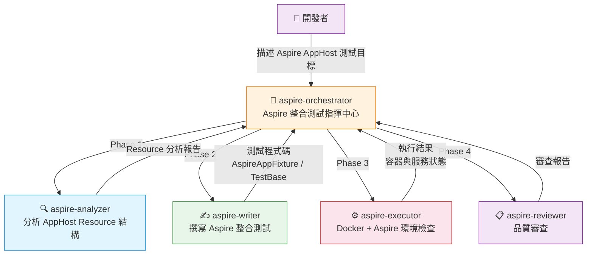
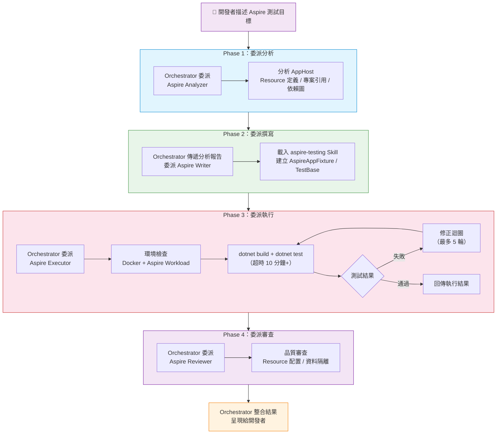

# .NET Aspire 整合測試 Orchestrator - dotnet-testing-advanced-aspire-orchestrator

- [.NET Aspire 整合測試 Orchestrator - dotnet-testing-advanced-aspire-orchestrator](#net-aspire-整合測試-orchestrator---dotnet-testing-advanced-aspire-orchestrator)
  - [簡介](#簡介)
  - [架構總覽](#架構總覽)
  - [核心工作流程](#核心工作流程)
    - [Phase 1：委派分析（Aspire Analyzer）](#phase-1委派分析aspire-analyzer)
      - [AppHost Resource 分析](#apphost-resource-分析)
    - [Phase 2：委派撰寫（Aspire Writer）](#phase-2委派撰寫aspire-writer)
    - [Phase 3：委派執行（Aspire Executor）](#phase-3委派執行aspire-executor)
    - [Phase 4：委派審查（Aspire Reviewer）](#phase-4委派審查aspire-reviewer)
  - [各 Subagent 職責說明](#各-subagent-職責說明)
  - [使用的 Agent Skills](#使用的-agent-skills)
  - [關鍵特色](#關鍵特色)
    - [AppHost 中心式架構](#apphost-中心式架構)
    - [宣告式容器管理](#宣告式容器管理)
    - [最低 Context Window 壓力](#最低-context-window-壓力)
    - [Resource 名稱一致性](#resource-名稱一致性)
    - [環境需求不可跳過](#環境需求不可跳過)
  - [使用方式](#使用方式)
    - [啟動](#啟動)
    - [輸入範例](#輸入範例)
    - [結果呈現](#結果呈現)
  - [與 Integration Orchestrator 的差異](#與-integration-orchestrator-的差異)

## 簡介

`dotnet-testing-advanced-aspire-orchestrator` 是 .NET Aspire 整合測試的指揮中心。它負責**分析 AppHost Resource 結構、委派 subagent 撰寫、執行與審查 Aspire 整合測試**，而不是自己直接撰寫測試程式碼。

適用場景：

- 在 **.NET Aspire** 架構下測試 API 服務的端點
- 使用 **DistributedApplicationTestingBuilder** 建立測試環境
- 測試 AppHost 編排的多服務架構（API + 資料庫 + 快取）

---

## 架構總覽

`dotnet-testing-advanced-aspire-orchestrator` 採用 **1+4 架構**，管轄單一 Skill（`aspire-testing`），Context Window 壓力為四個 Orchestrator 中最低。



| 項目          | 說明                                                                           |
| ------------- | ------------------------------------------------------------------------------ |
| **模型配置**  | Claude Sonnet 4.6 / Claude Opus 4.6（Fallback）                                |
| **工具**      | `agent`, `read`, `search`, `usages`, `listDir`                                 |
| **Subagents** | `dotnet-testing-advanced-aspire-analyzer`, `-writer`, `-executor`, `-reviewer` |
| **Skills**    | 單一 Skill：`aspire-testing`                                                   |

---

## 核心工作流程



### Phase 1：委派分析（Aspire Analyzer）

Orchestrator 將 Aspire AppHost 專案交給 `dotnet-testing-advanced-aspire-analyzer` 分析。

報告包含的關鍵欄位：

| 欄位                         | 說明                                                               |
| ---------------------------- | ------------------------------------------------------------------ |
| `projectName`                | AppHost 專案名稱                                                   |
| `orchestrationType`          | 固定為 `"aspire"`                                                  |
| `appHostInfo`                | AppHost 資訊（Resource 定義、專案引用、依賴圖、containerLifetime） |
| `apiProjectInfo`             | 被編排 API 專案的端點結構、DbContext、Validators                   |
| `requiredSkills`             | 固定為 `["aspire-testing"]`                                        |
| `existingTestInfrastructure` | 既有測試基礎設施（AspireAppFixture、Collection Fixture 等）        |
| `suggestedTestScenarios`     | **中文三段式命名**的建議測試案例清單                               |
| `projectContext`             | 專案結構資訊（.slnx / .csproj 路徑）                               |

#### AppHost Resource 分析

Analyzer 會深入解析 AppHost 的 `Program.cs`，識別：

- **專案資源**：`AddProject<T>("name")` 定義的服務
- **容器資源**：`AddSqlServer()`、`AddRedis()`、`AddPostgres()` 等
- **資源間依賴**：`WithReference()` 建立的依賴關係
- **容器生命週期**：`containerLifetime` 配置（persistent / session）

### Phase 2：委派撰寫（Aspire Writer）

Writer 載入 `aspire-testing` Skill，使用 Aspire 專屬的測試基礎設施建立測試。

**Aspire 測試的核心差異**（與一般整合測試不同）：

| 項目           | Aspire 測試                            | 一般整合測試             |
| -------------- | -------------------------------------- | ------------------------ |
| **測試建構器** | `DistributedApplicationTestingBuilder` | `WebApplicationFactory`  |
| **HttpClient** | `app.CreateHttpClient("servicename")`  | `factory.CreateClient()` |
| **容器管理**   | 由 AppHost 宣告式管理                  | 程式化 Testcontainers    |
| **服務啟動**   | 整個 AppHost 一起啟動                  | 單一 Web 應用程式        |

Writer 建立的測試基礎設施：

- **AspireAppFixture**：封裝 `DistributedApplicationTestingBuilder` 的建立與銷毀
- **CollectionDefinition**：確保同一 Collection 的測試共用同一個 AppHost 實例
- **IntegrationTestBase**：測試基底類別，提供 HttpClient 與資料清理

**Resource 名稱一致性**：`CreateHttpClient("name")` 的名稱必須與 AppHost 中 `AddProject("name")` 的名稱完全一致，否則會找不到對應的服務。

### Phase 3：委派執行（Aspire Executor）

Executor 負責環境檢查與測試執行，Aspire 測試有額外的環境需求：

| 環境需求            | 說明                              | 檢查方式                    |
| ------------------- | --------------------------------- | --------------------------- |
| **Docker Desktop**  | Aspire 透過 Docker 管理容器資源   | 確認 Docker daemon 執行中   |
| **Aspire Workload** | .NET Aspire SDK 需要安裝 workload | `dotnet workload list` 確認 |
| **超時設定**        | AppHost 啟動 + 多容器需要較長時間 | 建議 10 分鐘以上            |

> Aspire 測試**必須**有 Docker 環境，無法使用 InMemory 模式替代。如果 Docker 未啟動，Executor 會中止執行並提供修正指引。

### Phase 4：委派審查（Aspire Reviewer）

Reviewer 審查測試程式碼的品質，重點包含：

- `DistributedApplicationTestingBuilder` 使用是否正確
- Resource 名稱與 AppHost 是否一致
- 資料隔離機制（Respawn 配置）
- 容器資源配置合理性

---

## 各 Subagent 職責說明

| Subagent            | 角色   | 主要職責                                                             | 核心工具                                |
| ------------------- | ------ | -------------------------------------------------------------------- | --------------------------------------- |
| **aspire-analyzer** | 分析者 | 分析 AppHost Resource 定義、專案引用、依賴圖                         | `read`, `search`, `listDir`             |
| **aspire-writer**   | 撰寫者 | 載入 aspire-testing Skill，建立 AspireAppFixture、TestBase、測試類別 | `read`, `search`, `edit`, `runCommands` |
| **aspire-executor** | 執行者 | Docker + Aspire Workload 環境檢查、`dotnet test` 執行                | `read`, `edit`, `runCommands`           |
| **aspire-reviewer** | 審查者 | 審查 Aspire 測試品質、Resource 配置、資料隔離                        | `read`, `search`                        |

---

## 使用的 Agent Skills

Aspire Orchestrator 固定使用單一 Skill：

| Skill                                    | 說明                             |
| ---------------------------------------- | -------------------------------- |
| `dotnet-testing-advanced-aspire-testing` | .NET Aspire Testing 框架完整指引 |

**為何只需一個 Skill？**

Aspire 整合測試的知識集中在一個 Skill 中，涵蓋：

- `DistributedApplicationTestingBuilder` 使用方式
- AppHost Fixture 設計模式
- Resource 名稱對應與 HttpClient 建立
- 容器生命週期管理
- 資料隔離與清理策略

這使得 Aspire Orchestrator 的 Context Window 壓力為四個 Orchestrator 中最低，AI 推理效率最高。

---

## 關鍵特色

### AppHost 中心式架構

Aspire 測試的一切圍繞 AppHost 的 Resource 定義展開。Analyzer 解析 AppHost 的 `Program.cs` 後，能完整掌握：

- 有哪些服務被編排
- 服務之間的依賴關係
- 需要啟動哪些容器資源
- 容器的生命週期配置

### 宣告式容器管理

與 Integration Orchestrator 使用程式化 Testcontainers 不同，Aspire 測試的容器由 AppHost **宣告式管理**：

- 不需要在測試程式碼中手動啟動/停止容器
- 容器隨 AppHost 啟動自動建立，隨 AppHost 銷毀自動清除
- 測試程式碼只需關注測試邏輯，無需管理容器生命週期

### 最低 Context Window 壓力

由於只載入一個 Skill（`aspire-testing`），Writer 的 Context Window 中只有一份知識文件，相較於單元測試 Orchestrator 可能載入 10+ Skills，AI 能更專注地產出高品質測試程式碼。

### Resource 名稱一致性

`CreateHttpClient("name")` 的 `"name"` 必須與 AppHost 中 `AddProject<T>("name")` 的 `"name"` 完全一致。Analyzer 會在分析報告中明確列出所有 Resource 名稱，Writer 必須嚴格遵循。

### 環境需求不可跳過

Aspire 測試對環境有嚴格要求：

- **Docker Desktop**：必須執行中（容器由 Aspire 透過 Docker 管理）
- **.NET Aspire Workload**：必須已安裝（`dotnet workload install aspire`）

兩項環境檢查缺一不可，Executor 在執行測試前會先驗證環境。

---

## 使用方式

### 啟動

在 VS Code Copilot Chat 的 Agent 下拉選單中選擇 `dotnet-testing-advanced-aspire-orchestrator`，然後描述要測試的 Aspire AppHost 專案。

### 輸入範例

```plaintext
Aspire.AppHost 中 webapi 服務的所有 API 端點
```

```plaintext
為 AppHost 中 catalog-api 和 ordering-api 兩個服務建立整合測試
```

### 結果呈現

Orchestrator 會整合四個 subagent 的回傳結果，呈現以下內容：

- 完整的測試程式碼（含 AspireAppFixture、CollectionDefinition、TestBase、測試類別）
- `dotnet test` 執行結果摘要
- Docker + Aspire 環境狀態
- AppHost 啟動與容器資源狀態
- 品質審查評分與 issues
- Executor 修正紀錄（如果有的話）

---

## 與 Integration Orchestrator 的差異

| 比較項目         | Integration Orchestrator         | Aspire Orchestrator                    |
| ---------------- | -------------------------------- | -------------------------------------- |
| **測試建構器**   | `WebApplicationFactory<Program>` | `DistributedApplicationTestingBuilder` |
| **HttpClient**   | `factory.CreateClient()`         | `app.CreateHttpClient("servicename")`  |
| **容器管理**     | 程式化 Testcontainers            | AppHost 宣告式管理                     |
| **容器啟動**     | 測試程式碼中手動啟動/停止        | 隨 AppHost 自動建立/銷毀               |
| **Skills 數量**  | 4 個整合測試 Skills              | 1 個 Skill（`aspire-testing`）         |
| **環境需求**     | Docker Desktop                   | Docker Desktop + Aspire Workload       |
| **超時建議**     | 一般                             | 10 分鐘+（多服務 + 多容器啟動）        |
| **Context 壓力** | 中等（4 Skills）                 | 最低（1 Skill）                        |
| **適用架構**     | 獨立 WebAPI 專案                 | Aspire 編排的多服務架構                |
