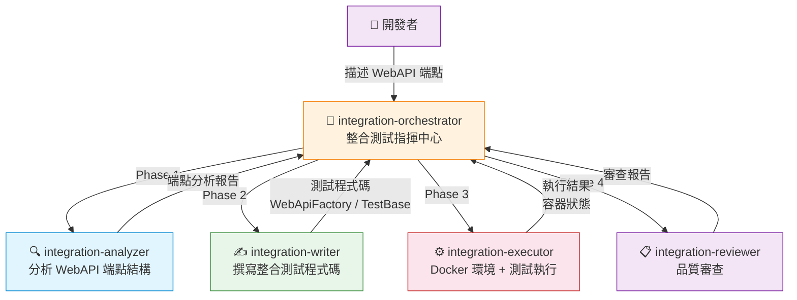
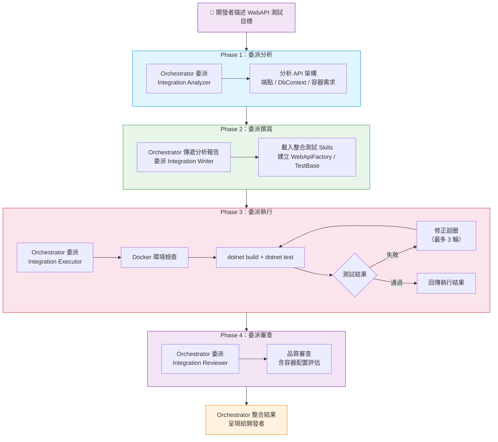

# .NET 整合測試 Orchestrator - dotnet-testing-advanced-integration-orchestrator

- [.NET 整合測試 Orchestrator - dotnet-testing-advanced-integration-orchestrator](#net-整合測試-orchestrator---dotnet-testing-advanced-integration-orchestrator)
  - [簡介](#簡介)
  - [架構總覽](#架構總覽)
  - [核心工作流程](#核心工作流程)
    - [Phase 1：委派分析（Integration Analyzer）](#phase-1委派分析integration-analyzer)
      - [DbContext 註冊模式分析](#dbcontext-註冊模式分析)
    - [Phase 2：委派撰寫（Integration Writer）](#phase-2委派撰寫integration-writer)
    - [Phase 3：委派執行（Integration Executor）](#phase-3委派執行integration-executor)
    - [Phase 4：委派審查（Integration Reviewer）](#phase-4委派審查integration-reviewer)
  - [各 Subagent 職責說明](#各-subagent-職責說明)
  - [使用的 Agent Skills](#使用的-agent-skills)
  - [關鍵特色](#關鍵特色)
    - [WebAPI 端點自動分析](#webapi-端點自動分析)
    - [DbContext 註冊模式分析](#dbcontext-註冊模式分析-1)
    - [Testcontainers 容器整合](#testcontainers-容器整合)
    - [型別衝突預防機制](#型別衝突預防機制)
    - [生產程式碼 Bug 發現](#生產程式碼-bug-發現)
    - [對稱驗證覆蓋](#對稱驗證覆蓋)
  - [使用方式](#使用方式)
    - [啟動](#啟動)
    - [輸入範例](#輸入範例)
    - [結果呈現](#結果呈現)
  - [與單元測試 Orchestrator 的差異](#與單元測試-orchestrator-的差異)

## 簡介

`dotnet-testing-advanced-integration-orchestrator` 是 .NET 整合測試的指揮中心。它負責**分析 WebAPI 端點結構、委派 subagent 撰寫、執行與審查整合測試**，而不是自己直接撰寫測試程式碼。

適用場景：

- 為 ASP.NET Core **WebAPI** 建立整合測試
- 使用 **WebApplicationFactory** 建立測試伺服器
- 使用 **Testcontainers** 進行容器化資料庫測試（PostgreSQL、MSSQL、MongoDB、Redis）
- 測試完整的 HTTP 請求/回應流程（含中介軟體、驗證、錯誤處理）

---

## 架構總覽

`dotnet-testing-advanced-integration-orchestrator` 採用 **1+4 架構**，管轄 4 個整合測試 Skills。



| 項目          | 說明                                                                                |
| ------------- | ----------------------------------------------------------------------------------- |
| **模型配置**  | Claude Sonnet 4.6 / Claude Opus 4.6（Fallback）                                     |
| **工具**      | `agent`, `read`, `search`, `usages`, `listDir`                                      |
| **Subagents** | `dotnet-testing-advanced-integration-analyzer`, `-writer`, `-executor`, `-reviewer` |

---

## 核心工作流程



### Phase 1：委派分析（Integration Analyzer）

Orchestrator 將 WebAPI 專案或 Controller 交給 `dotnet-testing-advanced-integration-analyzer` 分析。

報告包含的關鍵欄位：

| 欄位                     | 說明                                                             |
| ------------------------ | ---------------------------------------------------------------- |
| `projectName`            | WebAPI 專案名稱                                                  |
| `apiArchitecture`        | API 架構類型：`"controller-based"` / `"minimal-api"` / `"mixed"` |
| `endpointsToTest`        | 要測試的端點清單（HTTP method、route、參數、回傳型別）           |
| `dbContextInfo`          | DbContext 資訊（名稱、Provider、Entities）                       |
| `dbRegistrationAnalysis` | Program.cs 中 DbContext 的註冊模式分析                           |
| `containerRequirements`  | 需要的容器清單（類型、映像、用途）                               |
| `middlewarePipeline`     | 中介軟體管線分析（ExceptionHandler、Authentication 等）          |
| `validatorInfo`          | FluentValidation 整合分析                                        |
| `typeConflictRisks`      | 潛在型別名稱衝突風險                                             |
| `requiredSkills`         | 需要載入的整合測試 Skills 識別碼清單                             |
| `suggestedTestScenarios` | **中文三段式命名**的建議測試案例清單                             |

#### DbContext 註冊模式分析

Analyzer 會深入分析 `Program.cs` 中 DbContext 的註冊方式，這直接影響測試策略：

| 註冊模式                  | 說明                             | 測試影響                             |
| ------------------------- | -------------------------------- | ------------------------------------ |
| `hardcoded-unconditional` | 直接寫死 DB Provider，無環境判斷 | 需先修改 Program.cs 加入環境條件判斷 |
| `conditional`             | 已有環境條件判斷                 | 可直接在 ConfigureServices 中替換    |
| `no-registration`         | 未在 Program.cs 註冊             | 需在測試中自行註冊                   |

### Phase 2：委派撰寫（Integration Writer）

Writer 根據 `requiredSkills` 載入整合測試 Skills，建立完整的測試基礎設施：

- **WebApiFactory**：繼承 `WebApplicationFactory<Program>`，配置測試用 DbContext 與容器
- **IntegrationTestBase**：測試基底類別，提供 HttpClient、資料清理（Respawn）
- **測試類別**：依 Controller 分檔，按端點建立測試方法

重要提醒項目：

- 使用 `ConfigureServices`（非 `ConfigureTestServices`）
- 使用 `SingleOrDefault` descriptor 移除模式
- 直接初始化 Container，在 `InitializeAsync` 中 `EnsureCreatedAsync`
- 遵循 `Fixtures/` + `TestBase/` + `Controllers/` 目錄結構
- 型別衝突預防：當涉及 Redis 容器時，在 GlobalUsings.cs 中加入型別別名

### Phase 3：委派執行（Integration Executor）

Executor 負責 Docker 環境檢查、建置與執行測試。

特殊授權：**生產程式碼 Bug 修正** — 如果整合測試因生產程式碼缺陷而失敗（例如 Controller 未注入已存在的 Validator），Executor 被授權修正生產程式碼，並在回傳結果中明確標記為「生產程式碼 Bug 修正」。

### Phase 4：委派審查（Integration Reviewer）

Reviewer 審查測試程式碼的品質，包含容器配置評估、資料隔離驗證、HTTP 狀態碼斷言等。

---

## 各 Subagent 職責說明

| Subagent                 | 角色   | 主要職責                                                    | 核心工具                                |
| ------------------------ | ------ | ----------------------------------------------------------- | --------------------------------------- |
| **integration-analyzer** | 分析者 | 分析 WebAPI 端點結構、DbContext、容器需求、中介軟體管線     | `read`, `search`, `listDir`             |
| **integration-writer**   | 撰寫者 | 載入整合測試 Skills，建立 WebApiFactory、TestBase、測試類別 | `read`, `search`, `edit`, `runCommands` |
| **integration-executor** | 執行者 | Docker 環境檢查、`dotnet test` 執行、生產 Bug 修正          | `read`, `edit`, `runCommands`           |
| **integration-reviewer** | 審查者 | 審查測試品質、容器配置、資料隔離、斷言完整性                | `read`, `search`                        |

---

## 使用的 Agent Skills

整合測試 Orchestrator 管轄 4 個整合測試 Skills：

| Skill                                                | 說明                               |
| ---------------------------------------------------- | ---------------------------------- |
| `dotnet-testing-advanced-aspnet-integration-testing` | WebApplicationFactory 整合測試基礎 |
| `dotnet-testing-advanced-webapi-integration-testing` | WebAPI 完整整合測試流程            |
| `dotnet-testing-advanced-testcontainers-database`    | PostgreSQL / MSSQL 容器化測試      |
| `dotnet-testing-advanced-testcontainers-nosql`       | MongoDB / Redis 容器化測試         |

> Writer 根據 Analyzer 的 `requiredSkills` 決定載入哪些 Skills。例如，如果測試不涉及 NoSQL 資料庫，就不會載入 `testcontainers-nosql` Skill。

---

## 關鍵特色

### WebAPI 端點自動分析

Analyzer 自動識別 API 架構類型，支援：

- **Controller-based**：傳統 MVC Controller 模式
- **Minimal API**：.NET 6+ 的 Minimal API 模式
- **Mixed**：兩種模式混合使用

### DbContext 註冊模式分析

自動偵測 `Program.cs` 中 DbContext 的註冊方式，並根據分析結果決定測試策略。當偵測到 `hardcoded-unconditional` 模式且需要替換 DB Provider 時，會建議先修改 Program.cs 加入環境條件判斷。

### Testcontainers 容器整合

支援多種容器化資料庫測試：

| 容器類型   | 映像                             | 用途                 |
| ---------- | -------------------------------- | -------------------- |
| PostgreSQL | `postgres:latest`                | 關聯式資料庫測試     |
| MSSQL      | `mcr.microsoft.com/mssql/server` | SQL Server 測試      |
| MongoDB    | `mongo:latest`                   | NoSQL 文件資料庫測試 |
| Redis      | `redis:latest`                   | 快取 / NoSQL 測試    |

### 型別衝突預防機制

當測試涉及 Redis 容器時，`StackExchange.Redis` SDK 命名空間可能包含與應用程式領域模型同名的型別（如 `StackExchange.Redis.Order` 與應用程式的 `Order` 模型衝突）。Analyzer 會識別這些風險，Writer 在 `GlobalUsings.cs` 中主動建立型別別名以避免編譯錯誤。

### 生產程式碼 Bug 發現

整合測試的核心價值之一是發現生產程式碼中的真實 Bug。例如，Controller Action 有對應的 Validator 但未注入 `IValidator<T>` 也未呼叫 `ValidateAndThrowAsync()`，這類缺陷只有透過完整的整合測試才能發現。

Orchestrator 在最終結果中會**特別標記**此類發現，這是整合測試 ROI 的直接證明。

### 對稱驗證覆蓋

當多個端點共用相同的驗證規則時（如 Create 和 Update 使用相同的 Validator 規則），Orchestrator 確保所有端點的驗證測試覆蓋率對等，避免遺漏。

---

## 使用方式

### 啟動

在 VS Code Copilot Chat 的 Agent 下拉選單中選擇 `dotnet-testing-advanced-integration-orchestrator`，然後描述要測試的 WebAPI 專案或 Controller。

### 輸入範例

```plaintext
ProductsController 的所有 CRUD 端點
```

```plaintext
為 OrdersController 和 CustomersController 建立整合測試，使用 SQL Server 容器
```

### 結果呈現

Orchestrator 會整合四個 subagent 的回傳結果，呈現以下內容：

- 完整的測試程式碼（含 WebApiFactory、TestBase、測試類別）
- `dotnet test` 執行結果摘要
- Docker 環境狀態與容器啟動資訊
- 品質審查評分與 issues
- 使用的 Skills 組合
- 生產程式碼 Bug 發現（如果有的話）
- Executor 修正紀錄（如果有的話）

---

## 與單元測試 Orchestrator 的差異

| 比較項目        | 單元測試 Orchestrator             | 整合測試 Orchestrator              |
| --------------- | --------------------------------- | ---------------------------------- |
| **測試範圍**    | 單一類別/方法                     | WebAPI 端點（含完整 HTTP 流程）    |
| **測試建構器**  | 直接建構類別實例                  | `WebApplicationFactory<Program>`   |
| **資料庫**      | Mock / InMemory                   | Testcontainers（真實容器化資料庫） |
| **Docker**      | 不需要                            | 必要（Testcontainers 依賴 Docker） |
| **Skills 數量** | 多技能動態載入（最多 20+ Skills） | 4 個整合測試 Skills                |
| **目標類型**    | Service / Validator / Legacy      | Controller / Minimal API           |
| **特殊能力**    | 三種目標類型深度分析              | 生產 Bug 發現、型別衝突預防        |
