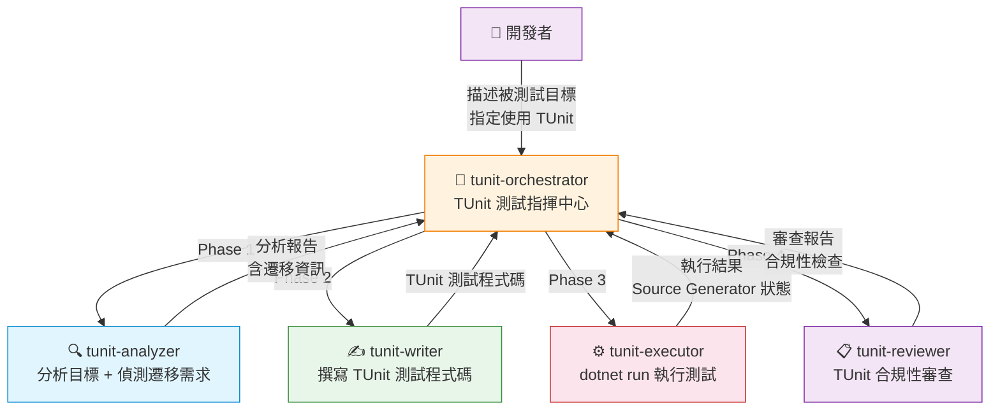
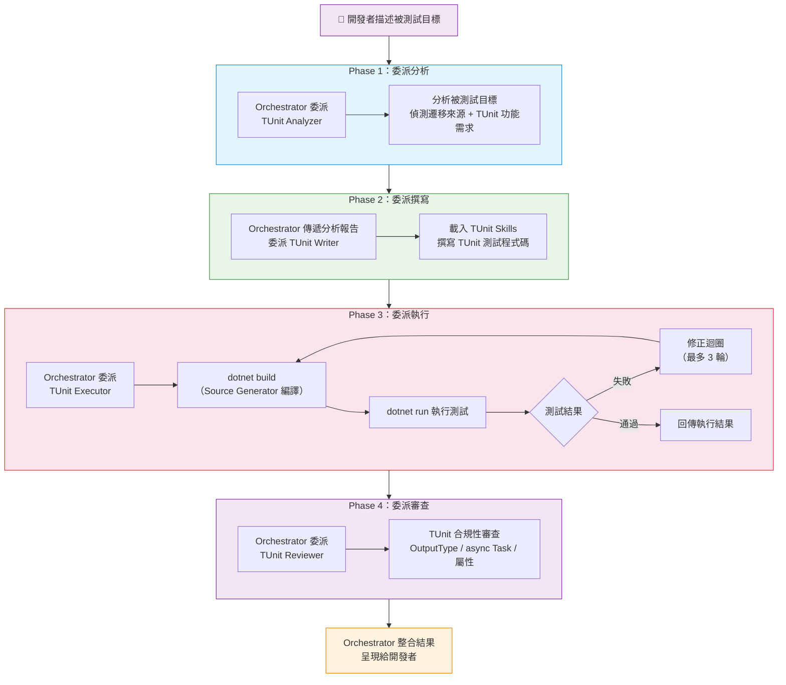

# TUnit 測試 Orchestrator - dotnet-testing-advanced-tunit-orchestrator

- [TUnit 測試 Orchestrator - dotnet-testing-advanced-tunit-orchestrator](#tunit-測試-orchestrator---dotnet-testing-advanced-tunit-orchestrator)
  - [簡介](#簡介)
  - [架構總覽](#架構總覽)
  - [核心工作流程](#核心工作流程)
    - [Phase 1：委派分析（TUnit Analyzer）](#phase-1委派分析tunit-analyzer)
      - [TUnit 功能需求分析](#tunit-功能需求分析)
    - [Phase 2：委派撰寫（TUnit Writer）](#phase-2委派撰寫tunit-writer)
    - [Phase 3：委派執行（TUnit Executor）](#phase-3委派執行tunit-executor)
    - [Phase 4：委派審查（TUnit Reviewer）](#phase-4委派審查tunit-reviewer)
  - [各 Subagent 職責說明](#各-subagent-職責說明)
  - [使用的 Agent Skills](#使用的-agent-skills)
  - [關鍵特色](#關鍵特色)
    - [Source Generator 驅動](#source-generator-驅動)
    - [`dotnet run` 執行模式](#dotnet-run-執行模式)
    - [強制 async Task](#強制-async-task)
    - [與 xUnit 的屬性對照](#與-xunit-的屬性對照)
    - [框架遷移支援](#框架遷移支援)
    - [版本相依性管理](#版本相依性管理)
  - [使用方式](#使用方式)
    - [啟動](#啟動)
    - [輸入範例](#輸入範例)
    - [結果呈現](#結果呈現)
  - [與單元測試 Orchestrator 的差異](#與單元測試-orchestrator-的差異)

## 簡介

`dotnet-testing-advanced-tunit-orchestrator` 是 TUnit 測試的指揮中心。它負責**分析被測試目標、決定 TUnit 技術組合、委派 subagent 撰寫、執行與審查 TUnit 測試**，而不是自己直接撰寫測試程式碼。

適用場景：

- 使用 **TUnit** 新世代測試框架撰寫測試
- 從 **xUnit** 或 **NUnit** 遷移至 TUnit
- 利用 TUnit 的 **Source Generator** 與 **`dotnet run`** 執行模式提升測試效率

---

## 架構總覽

`dotnet-testing-advanced-tunit-orchestrator` 採用 **1+4 架構**，管轄 2 個 TUnit Skills（`tunit-fundamentals` 必載 + `tunit-advanced` 條件載入）。



| 項目          | 說明                                                                          |
| ------------- | ----------------------------------------------------------------------------- |
| **模型配置**  | Claude Sonnet 4.6 / Claude Opus 4.6（Fallback）                               |
| **工具**      | `agent`, `read`, `search`, `usages`, `listDir`                                |
| **Subagents** | `dotnet-testing-advanced-tunit-analyzer`, `-writer`, `-executor`, `-reviewer` |
| **Skills**    | `tunit-fundamentals`（必載）+ `tunit-advanced`（條件載入）                    |

---

## 核心工作流程



### Phase 1：委派分析（TUnit Analyzer）

Orchestrator 將被測試目標交給 `dotnet-testing-advanced-tunit-analyzer` 分析。

報告包含的關鍵欄位：

| 欄位                         | 說明                                               |
| ---------------------------- | -------------------------------------------------- |
| `projectName`                | 測試專案名稱                                       |
| `testFramework`              | 固定為 `"tunit"`                                   |
| `migrationSource`            | 遷移來源：`null`（新專案）、`"xunit"` 或 `"nunit"` |
| `targetClasses`              | 被測類別清單（含依賴、方法、matrixCandidate 等）   |
| `tunitFeatureRequirements`   | TUnit 功能需求分析                                 |
| `requiredSkills`             | 需載入的 Skills 清單                               |
| `existingTestInfrastructure` | 既有測試基礎設施（測試檔案、NuGet 套件）           |
| `suggestedTestScenarios`     | **中文三段式命名**的建議測試案例清單               |

#### TUnit 功能需求分析

Analyzer 會評估被測試目標需要哪些 TUnit 功能，以決定是否載入 `tunit-advanced` Skill：

| 功能                    | 說明                              | 載入 Skill           |
| ----------------------- | --------------------------------- | -------------------- |
| `basicTest`             | 基本 `[Test]` 測試                | `tunit-fundamentals` |
| `arguments`             | `[Arguments]` 參數化測試          | `tunit-fundamentals` |
| `methodDataSource`      | `[MethodDataSource]` 方法資料來源 | `tunit-fundamentals` |
| `classDataSource`       | `[ClassDataSource]` 類別資料來源  | `tunit-advanced`     |
| `matrixTests`           | `[Matrix]` 矩陣測試               | `tunit-advanced`     |
| `dependencyInjection`   | TUnit DI 整合                     | `tunit-advanced`     |
| `notInParallel`         | `[NotInParallel]` 序列執行控制    | `tunit-advanced`     |
| `retry`                 | `[Retry]` 重試機制                | `tunit-advanced`     |
| `webApplicationFactory` | WebApplicationFactory 整合        | `tunit-advanced`     |
| `testcontainers`        | Testcontainers 整合               | `tunit-advanced`     |

### Phase 2：委派撰寫（TUnit Writer）

Writer 載入 TUnit Skills，使用 TUnit 專屬語法撰寫測試程式碼。

**TUnit 專案結構嚴格要求**：

| 要求                       | 說明                                       |
| -------------------------- | ------------------------------------------ |
| **OutputType**             | 必須為 `Exe`（非 `Library`）               |
| **Microsoft.NET.Test.Sdk** | **不需要**，也不可引用                     |
| **測試方法簽章**           | 所有 `[Test]` 方法**必須**為 `async Task`  |
| **測試屬性**               | 使用 `[Test]`（非 `[Fact]`）               |
| **參數化**                 | 使用 `[Arguments]`（非 `[InlineData]`）    |
| **生命週期**               | 使用 `[Before(Test)]` / `[After(Test)]`    |
| **版本**                   | TUnit 0.6.123 與 Testing.Platform 版本鏈鎖 |

**遷移場景處理**：如果 `migrationSource` 不為 null，Writer 會自動轉換：

- 測試屬性：`[Fact]` → `[Test]`、`[Theory]` → `[Test]` + `[Arguments]`
- 方法簽章：`void` → `async Task`
- 資料來源：`[InlineData]` → `[Arguments]`、`[MemberData]` → `[MethodDataSource]`
- 生命週期：建構子 → `[Before(Test)]`、`IDisposable` → `[After(Test)]`

### Phase 3：委派執行（TUnit Executor）

Executor 負責建置與執行 TUnit 測試，執行方式與傳統測試框架不同：

| 項目            | TUnit                               | xUnit / NUnit    |
| --------------- | ----------------------------------- | ---------------- |
| **推薦執行**    | `dotnet run`（TUnit 原生）          | `dotnet test`    |
| **備選執行**    | `dotnet test`（也支援）             | —                |
| **首次建置**    | 較慢（Source Generator 產生程式碼） | 一般速度         |
| **後續執行**    | 極快（已產生的程式碼直接執行）      | 一般速度         |
| **Engine Mode** | SourceGenerated                     | Reflection-based |

> TUnit 使用 Source Generator 在編譯時期產生測試基礎設施程式碼，因此首次建置可能較慢，但後續執行速度顯著提升。

### Phase 4：委派審查（TUnit Reviewer）

Reviewer 除了一般品質審查外，還會進行 **TUnit 合規性檢查**：

- OutputType 是否為 `Exe`
- 是否有 `Microsoft.NET.Test.Sdk` 引用（不應有）
- 所有 `[Test]` 方法是否為 `async Task`
- 是否正確使用 TUnit 屬性（非 xUnit / NUnit 屬性）
- 版本相依性是否正確

---

## 各 Subagent 職責說明

| Subagent           | 角色   | 主要職責                                                           | 核心工具                                |
| ------------------ | ------ | ------------------------------------------------------------------ | --------------------------------------- |
| **tunit-analyzer** | 分析者 | 分析被測試目標、偵測遷移需求、評估 TUnit 功能需求                  | `read`, `search`, `listDir`             |
| **tunit-writer**   | 撰寫者 | 載入 TUnit Skills，撰寫符合 TUnit 規範的測試程式碼                 | `read`, `search`, `edit`, `runCommands` |
| **tunit-executor** | 執行者 | `dotnet build` + `dotnet run` 執行測試，處理 Source Generator 問題 | `read`, `edit`, `runCommands`           |
| **tunit-reviewer** | 審查者 | 品質審查 + TUnit 合規性檢查                                        | `read`, `search`                        |

---

## 使用的 Agent Skills

TUnit Orchestrator 管轄 2 個 TUnit Skills，採用條件載入機制：

| Skill                                        | 載入條件     | 說明                                                                                                                      |
| -------------------------------------------- | ------------ | ------------------------------------------------------------------------------------------------------------------------- |
| `dotnet-testing-advanced-tunit-fundamentals` | **必載**     | TUnit 基礎：`[Test]`、`[Arguments]`、`[MethodDataSource]`、async Task、生命週期                                           |
| `dotnet-testing-advanced-tunit-advanced`     | **條件載入** | TUnit 進階：`[Matrix]`、`[ClassDataSource]`、DI 整合、`[NotInParallel]`、`[Retry]`、WebApplicationFactory、Testcontainers |

**條件載入機制**：Analyzer 分析被測試目標的功能需求後，在 `requiredSkills` 中決定是否包含 `tunit-advanced`。如果被測試目標只需要基本的測試功能，則只載入 `tunit-fundamentals`，降低 Context Window 壓力。

---

## 關鍵特色

### Source Generator 驅動

TUnit 使用 **Source Generator** 在編譯時期產生測試基礎設施程式碼，而非傳統的 Reflection-based 執行模式。這帶來以下優勢：

- **編譯期錯誤偵測**：測試配置錯誤在編譯時就能發現，不需等到執行
- **執行速度更快**：已產生的程式碼直接執行，無需反射開銷
- **更好的 IDE 支援**：Source Generator 產生的程式碼可在 IDE 中瀏覽

### `dotnet run` 執行模式

TUnit 測試專案的 OutputType 為 `Exe`，可以直接使用 `dotnet run` 執行：

```bash
# TUnit 原生執行方式（推薦）
dotnet run --project path/to/Tests.csproj

# 也支援 dotnet test
dotnet test path/to/Tests.csproj
```

### 強制 async Task

所有 `[Test]` 方法**必須**為 `async Task`，這是 TUnit 的設計決策：

```csharp
// ✅ 正確
[Test]
public async Task MyTest() { ... }

// ❌ 錯誤 — TUnit 不支援 void 測試方法
[Test]
public void MyTest() { ... }
```

### 與 xUnit 的屬性對照

| xUnit 屬性      | TUnit 屬性           | 說明         |
| --------------- | -------------------- | ------------ |
| `[Fact]`        | `[Test]`             | 基本測試     |
| `[Theory]`      | `[Test]`             | 參數化測試   |
| `[InlineData]`  | `[Arguments]`        | 內聯測試資料 |
| `[MemberData]`  | `[MethodDataSource]` | 方法資料來源 |
| `[ClassData]`   | `[ClassDataSource]`  | 類別資料來源 |
| `Constructor`   | `[Before(Test)]`     | 測試前置作業 |
| `IDisposable`   | `[After(Test)]`      | 測試後置作業 |
| `IClassFixture` | `[ClassDataSource]`  | 共用 Fixture |
| `[Collection]`  | `[NotInParallel]`    | 序列執行控制 |

### 框架遷移支援

TUnit Orchestrator 支援從 xUnit 或 NUnit 遷移至 TUnit：

1. **Analyzer 自動偵測遷移來源**：檢查既有測試專案的 NuGet 套件引用
2. **Writer 自動轉換語法**：將 xUnit/NUnit 屬性、方法簽章、生命週期轉換為 TUnit 對應語法
3. **Reviewer 驗證轉換完整性**：確認所有轉換都符合 TUnit 規範

### 版本相依性管理

TUnit 0.6.123 與 Microsoft.Testing.Platform 之間存在嚴格的版本鏈鎖關係，Writer 和 Executor 必須確保版本一致，避免版本不匹配導致的建置失敗。

---

## 使用方式

### 啟動

在 VS Code Copilot Chat 的 Agent 下拉選單中選擇 `dotnet-testing-advanced-tunit-orchestrator`，然後描述要測試的類別或方法。

### 輸入範例

```plaintext
EmployeeService 的 ValidateEmployee 和 CalculateAnnualBonus 方法，使用 TUnit 框架
```

```plaintext
將 CalculatorServiceTests 從 xUnit 遷移到 TUnit
```

### 結果呈現

Orchestrator 會整合四個 subagent 的回傳結果，呈現以下內容：

- 完整的 TUnit 測試程式碼
- 執行結果摘要（執行方式、Engine Mode、測試數量）
- TUnit 合規性審查結果（OutputType、async Task、屬性檢查）
- 品質審查評分與 issues
- 使用的 Skills 組合
- 遷移紀錄（如果是從 xUnit/NUnit 遷移）
- Executor 修正紀錄（如果有的話）

---

## 與單元測試 Orchestrator 的差異

| 比較項目        | 單元測試 Orchestrator         | TUnit Orchestrator                   |
| --------------- | ----------------------------- | ------------------------------------ |
| **測試框架**    | xUnit                         | TUnit                                |
| **測試屬性**    | `[Fact]` / `[Theory]`         | `[Test]` / `[Arguments]`             |
| **方法簽章**    | `void` 或 `Task`              | 強制 `async Task`                    |
| **執行方式**    | `dotnet test`                 | `dotnet run`（推薦）/ `dotnet test`  |
| **專案類型**    | `Library`                     | `Exe`                                |
| **執行引擎**    | Reflection-based              | Source Generator                     |
| **Test SDK**    | 需要 `Microsoft.NET.Test.Sdk` | 不需要                               |
| **生命週期**    | 建構子 / `IDisposable`        | `[Before(Test)]` / `[After(Test)]`   |
| **Skills 數量** | 多技能動態載入（20+ Skills）  | 2 個 TUnit Skills（1 必載 + 1 條件） |
| **遷移支援**    | —                             | 支援從 xUnit / NUnit 遷移            |
