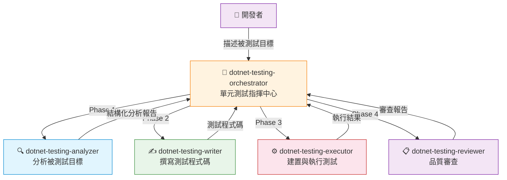
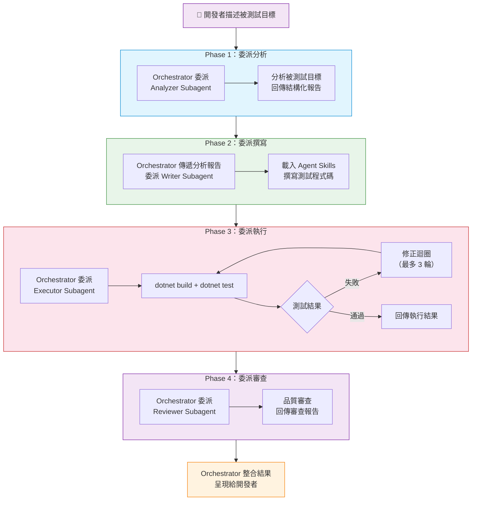

# .NET 單元測試 Orchestrator - dotnet-testing-orchestrator

- [.NET 單元測試 Orchestrator - dotnet-testing-orchestrator](#net-單元測試-orchestrator---dotnet-testing-orchestrator)
  - [簡介](#簡介)
  - [架構總覽](#架構總覽)
  - [核心工作流程](#核心工作流程)
    - [Phase 1：委派分析（Analyzer）](#phase-1委派分析analyzer)
      - [三種目標類型](#三種目標類型)
    - [Phase 2：委派撰寫（Writer）](#phase-2委派撰寫writer)
    - [Phase 3：委派執行（Executor）](#phase-3委派執行executor)
    - [Phase 4：委派審查（Reviewer）](#phase-4委派審查reviewer)
  - [各 Subagent 職責說明](#各-subagent-職責說明)
  - [使用的 Agent Skills](#使用的-agent-skills)
    - [Skills 分類](#skills-分類)
  - [關鍵特色](#關鍵特色)
    - [指揮者不執行原則](#指揮者不執行原則)
    - [三種目標類型深度分析](#三種目標類型深度分析)
    - [既有基礎設施沿用](#既有基礎設施沿用)
    - [中文三段式測試命名](#中文三段式測試命名)
    - [多目標平行支援](#多目標平行支援)
  - [使用方式](#使用方式)
    - [啟動](#啟動)
    - [輸入範例](#輸入範例)
    - [結果呈現](#結果呈現)

## 簡介

`dotnet-testing-orchestrator` 是 .NET 單元測試的指揮中心。它負責**分析被測試目標、決定技術組合、委派 subagent 撰寫、執行與審查測試**，而不是自己直接撰寫測試程式碼。

適用場景：

- 為 **Service** 類別建立單元測試（一般業務邏輯類別）
- 為 **Validator** 建立測試（FluentValidation 驗證器）
- 為 **Legacy Code** 建立特性測試（含靜態依賴、硬編碼資料的舊有程式碼）

---

## 架構總覽

`dotnet-testing-orchestrator` 採用 **1+4 架構**：1 個 Orchestrator 指揮 4 個專業化 Subagents，遵循 Conductor-Delegate Pattern。



| 項目          | 說明                                                                                                     |
| ------------- | -------------------------------------------------------------------------------------------------------- |
| **模型配置**  | Claude Sonnet 4.6 / Claude Opus 4.6（Fallback）                                                          |
| **工具**      | `agent`, `read`, `search`, `usages`, `search/listDirectory`                                              |
| **Subagents** | `dotnet-testing-analyzer`, `dotnet-testing-writer`, `dotnet-testing-executor`, `dotnet-testing-reviewer` |

---

## 核心工作流程

Orchestrator 必須嚴格遵循四階段流程，依序執行，不可跳過任何階段。



### Phase 1：委派分析（Analyzer）

Orchestrator 將被測試目標交給 `dotnet-testing-analyzer` 分析，等候回傳結構化分析報告。

報告包含的關鍵欄位：

| 欄位                         | 說明                                                           |
| ---------------------------- | -------------------------------------------------------------- |
| `className`                  | 被測試類別名稱                                                 |
| `dependencies`               | 依賴項清單（哪些需要 Mock、哪些有特殊處理）                    |
| `methodsToTest`              | 要測試的方法清單（回傳類型、複雜度、特殊邏輯）                 |
| `requiredTechniques`         | 需要的測試技術識別碼清單                                       |
| `suggestedTestScenarios`     | **中文三段式命名**的建議測試案例清單                           |
| `targetType`                 | 目標類型：`"service"`、`"validator"` 或 `"legacy"`             |
| `existingTestInfrastructure` | 既有測試基礎設施（如 `AutoDataWithCustomizationAttribute` 等） |
| `validatorInfo`              | Validator 專用分析（規則、巢狀驗證器、自訂方法、跨欄位規則）   |
| `legacyInfo`                 | Legacy Code 專用分析（靜態依賴、硬編碼資料、直接 IO 操作）     |
| `fileSystemOperations`       | IFileSystem 操作細節（檔案/目錄/路徑操作）                     |
| `timeProviderUsage`          | TimeProvider 使用細節（GetLocalNow / GetUtcNow 區分）          |

#### 三種目標類型

Analyzer 會自動識別被測試目標的類型，並據此調整分析策略：

- **Service**：一般業務邏輯類別，分析依賴項、方法簽章、特殊處理（TimeProvider、IFileSystem 等）
- **Validator**：FluentValidation 驗證器，深入分析驗證規則（rules、nestedValidators、customMethods、crossFieldRules）
- **Legacy**：含靜態依賴或硬編碼資料的舊有程式碼，分析可測試性問題與 Characterization Test 策略

### Phase 2：委派撰寫（Writer）

Orchestrator 將分析報告傳給 `dotnet-testing-writer`，Writer 根據 `requiredTechniques` 動態載入對應的 Agent Skills 撰寫測試。

重要傳遞項目：

- 完整的分析報告 JSON
- 被測試目標與相關依賴的檔案路徑
- `requiredTechniques` 清單（決定載入哪些 Skills）
- `suggestedTestScenarios` 清單（中文三段式命名）
- 既有測試基礎設施（Writer 必須沿用，不得重新建構）
- 目標類型專屬資訊（validatorInfo、legacyInfo、fileSystemOperations、timeProviderUsage）

### Phase 3：委派執行（Executor）

Orchestrator 將 Writer 產出的測試程式碼交給 `dotnet-testing-executor` 建置與執行。

- Executor 執行 `dotnet build` + `dotnet test`
- 如果測試失敗，進入修正迴圈（最多 3 輪）
- 回傳執行結果、修正紀錄、最終測試狀態

### Phase 4：委派審查（Reviewer）

Orchestrator 將測試程式碼交給 `dotnet-testing-reviewer` 審查。

- Reviewer 讀取最終版測試程式碼與被測試目標原始碼
- 根據分析報告比對測試覆蓋完整性
- 回傳品質評分（A~D）、issues 清單、建議增加的測試案例

---

## 各 Subagent 職責說明

| Subagent                    | 角色   | 主要職責                                               | 核心工具                                |
| --------------------------- | ------ | ------------------------------------------------------ | --------------------------------------- |
| **dotnet-testing-analyzer** | 分析者 | 分析被測試目標的依賴、方法、目標類型，回傳結構化報告   | `read`, `search`, `search/listDirectory` |
| **dotnet-testing-writer**   | 撰寫者 | 載入 Agent Skills，依據分析報告撰寫測試程式碼          | `read`, `search`, `edit`, `runCommands` |
| **dotnet-testing-executor** | 執行者 | 執行 `dotnet build` + `dotnet test`，修正編譯/執行錯誤 | `read`, `edit`, `runCommands`           |
| **dotnet-testing-reviewer** | 審查者 | 審查測試程式碼品質，驗證覆蓋率與命名規範               | `read`, `search`                        |

---

## 使用的 Agent Skills

單元測試 Orchestrator 採用**多技能動態載入**機制：Writer 根據 Analyzer 識別的 `requiredTechniques` 決定要載入的 Skills 組合。

### Skills 分類

| 分類         | 包含的 Skills                                                                                                                                                                                           |
| ------------ | ------------------------------------------------------------------------------------------------------------------------------------------------------------------------------------------------------- |
| **基礎測試** | `unit-test-fundamentals`、`test-naming-conventions`、`xunit-project-setup`                                                                                                                              |
| **斷言**     | `awesome-assertions-guide`、`complex-object-comparison`                                                                                                                                                 |
| **Mock**     | `nsubstitute-mocking`                                                                                                                                                                                   |
| **覆蓋率**   | `code-coverage-analysis`                                                                                                                                                                                |
| **可測試性** | `datetime-testing-timeprovider`、`filesystem-testing-abstractions`                                                                                                                                      |
| **測試資料** | `autofixture-basics`、`autofixture-customization`、`autodata-xunit-integration`、`autofixture-nsubstitute-integration`、`bogus-fake-data`、`autofixture-bogus-integration`、`test-data-builder-pattern` |
| **其他**     | `test-output-logging`、`private-internal-testing`、`fluentvalidation-testing`                                                                                                                           |

> 每次測試任務不會載入所有 Skills，而是根據分析結果精準載入所需的子集，以降低 Context Window 壓力。

---

## 關鍵特色

### 指揮者不執行原則

Orchestrator 嚴格遵守 Conductor-Delegate Pattern：

- 禁止直接讀取 SKILL.md 檔案（Skills 載入是 Writer 的職責）
- 禁止直接撰寫任何測試程式碼
- 禁止直接修改 .csproj 或 .cs 檔案
- 禁止直接執行 `dotnet build` 或 `dotnet test`

Orchestrator 的價值在於**正確分析與高效委派**，確保每個 subagent 得到它需要的資訊。

### 三種目標類型深度分析

針對不同類型的被測試目標，Analyzer 提供差異化的分析策略：

| 目標類型      | 分析重點                                         | 測試策略                                            |
| ------------- | ------------------------------------------------ | --------------------------------------------------- |
| **Service**   | 依賴項、方法簽章、TimeProvider、IFileSystem 使用 | 標準 AAA Pattern 單元測試                           |
| **Validator** | 驗證規則、巢狀驗證器、跨欄位規則                 | `TestValidate()` + `ShouldHaveValidationErrorFor()` |
| **Legacy**    | 靜態依賴、硬編碼資料、直接 IO 操作、可測試性問題 | Characterization Test 模式                          |

### 既有基礎設施沿用

Analyzer 會掃描現有測試專案中的基礎設施（如自訂 `AutoDataAttribute`、`FakeTimeProviderExtensions`、`TestBase` 等），Writer 必須沿用這些已有的設施，不得重新建構，確保測試風格一致。

### 中文三段式測試命名

所有建議的測試案例名稱都使用中文三段式格式：

```plaintext
方法名稱_情境描述_預期結果
```

例如：`ProcessOrder_當訂單金額為零_應拋出ArgumentException`

### 多目標平行支援

當使用者一次指定多個被測試類別時，各階段採用不同的平行策略：

| 階段             | 執行方式 | 原因                           |
| ---------------- | -------- | ------------------------------ |
| Phase 1 Analyzer | **平行** | 每個目標獨立分析，互不依賴     |
| Phase 2 Writer   | **平行** | 每個目標獨立撰寫測試           |
| Phase 3 Executor | **循序** | 同專案 `dotnet build` 不可並行 |
| Phase 4 Reviewer | **平行** | 每份測試獨立審查               |

---

## 使用方式

### 啟動

在 VS Code Copilot Chat 的 Agent 下拉選單中選擇 `dotnet-testing-orchestrator`，然後描述要測試的類別或方法。

### 輸入範例

```plaintext
OrderProcessingService 的 ProcessOrder 方法
```

```plaintext
幫 UserService、OrderService、PaymentService 寫測試
```

### 結果呈現

Orchestrator 會整合四個 subagent 的回傳結果，呈現以下內容：

- 完整的測試程式碼
- `dotnet test` 執行結果摘要
- 品質審查評分與 issues
- 建議增加的測試案例
- 使用的技術組合（載入了哪些 Skills）
- Executor 修正紀錄（如果有的話）
