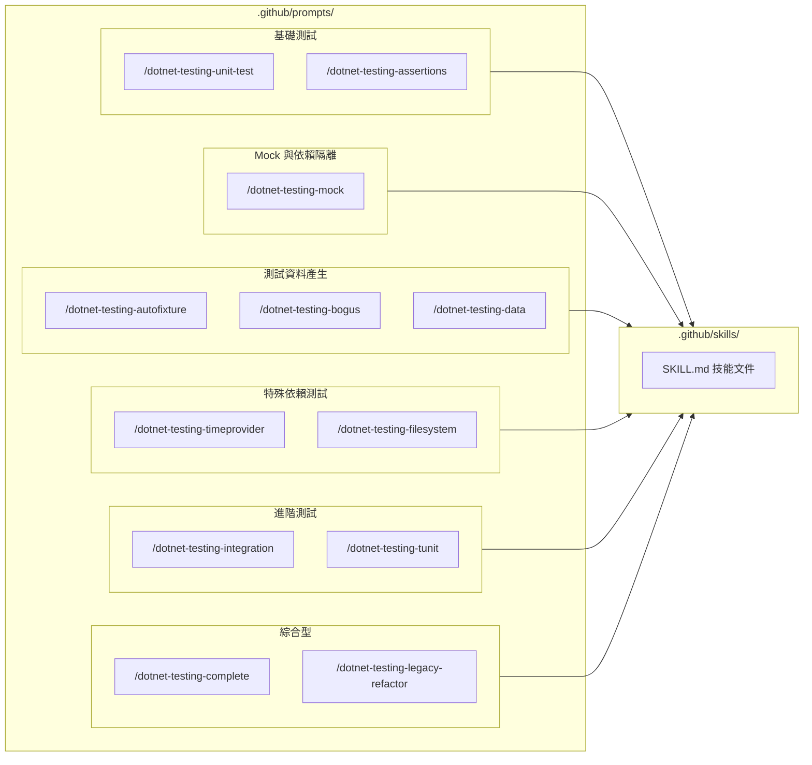

# GitHub Copilot Custom Prompts for .NET Testing

本文件說明針對 .NET 測試技能設計的 GitHub Copilot Custom Prompts，讓你能夠快速觸發各種測試相關的 AI 輔助功能。

## 目錄

- [什麼是 Custom Prompts](#什麼是-custom-prompts)
- [如何使用](#如何使用)
- [可用的 Prompts](#可用的-prompts)
  - [基礎測試](#基礎測試)
  - [Mock 與依賴隔離](#mock-與依賴隔離)
  - [測試資料產生](#測試資料產生)
  - [特殊依賴測試](#特殊依賴測試)
  - [進階測試](#進階測試)
  - [綜合型 Prompts](#綜合型-prompts)
- [技能文件參考](#技能文件參考)
- [自訂與擴充](#自訂與擴充)

---

## 什麼是 Custom Prompts

GitHub Copilot Custom Prompts（自訂提示）是一種讓你預先定義 AI 輔助指令的方式。透過在 `.github/prompts/` 目錄中建立 `.prompt.md` 檔案，你可以：

1. **簡化指令輸入** - 使用 `/prompt-name` 取代冗長的描述
2. **引用外部知識** - 在 prompt 中連結到技能文件（SKILL.md）
3. **標準化團隊實踐** - 確保所有團隊成員使用一致的測試模式
4. **加入任務指引** - 預設 AI 的行為和輸出格式

### Prompt 檔案結構

```markdown
---
name: prompt-name           # 觸發指令名稱
description: '描述文字'      # 顯示在選單中的說明
mode: agent                 # 執行模式（agent 或 edit）
---

# 標題

請參考以下技能文件：
- [技能名稱](路徑/SKILL.md)

## 任務說明

協助使用者完成的任務...
```

---

## 如何使用

### 方法 1：在 Copilot Chat 中使用

在 VS Code 的 Copilot Chat 面板中輸入：

```plaintext
@workspace /dotnet-testing-unit-test 幫我為 CalculatorService 寫測試
```

### 方法 2：搭配檔案選擇

1. 在編輯器中開啟要測試的檔案
2. 選取相關程式碼
3. 輸入 `/dotnet-testing-mock` 等指令

### 方法 3：使用 `#file` 引用

```plaintext
@workspace /dotnet-testing-complete #file:OrderService.cs 分析這個類別並寫測試
```

### 自動補全

輸入 `/` 後，VS Code 會自動顯示可用的 prompts 列表供選擇。

---

## 可用的 Prompts

### 基礎測試

#### `/dotnet-testing-unit-test`

**用途：** 建立基礎單元測試

**引用技能：**

- `dotnet-testing-unit-test-fundamentals`
- `dotnet-testing-test-naming-conventions`
- `dotnet-testing-xunit-project-setup`

**適用場景：**

- 為純邏輯類別撰寫測試
- 學習 3A Pattern（Arrange-Act-Assert）
- 建立新的測試專案

**使用範例：**

```plaintext
@workspace /dotnet-testing-unit-test 幫我為這個計算機類別寫單元測試
```

---

#### `/dotnet-testing-assertions`

**用途：** 使用 AwesomeAssertions 進行流暢斷言

**引用技能：**

- `dotnet-testing-awesome-assertions-guide`
- `dotnet-testing-complex-object-comparison`

**適用場景：**

- 需要進行複雜物件比對
- 想要更可讀的斷言語法
- 驗證例外和錯誤訊息

**使用範例：**

```plaintext
@workspace /dotnet-testing-assertions 這兩個物件要怎麼比對？
```

---

### Mock 與依賴隔離

#### `/dotnet-testing-mock`

**用途：** 使用 NSubstitute 建立測試替身

**引用技能：**

- `dotnet-testing-nsubstitute-mocking`

**適用場景：**

- 類別有外部依賴（Repository、Service）
- 需要模擬介面行為
- 驗證方法呼叫

**使用範例：**

```plaintext
@workspace /dotnet-testing-mock 這個 OrderService 依賴 IPaymentGateway，幫我寫測試
```

**涵蓋的 Test Double 類型：**

| 類型  | 說明                   |
| ----- | ---------------------- |
| Dummy | 填充物件，只為滿足參數 |
| Stub  | 提供預設回傳值         |
| Fake  | 簡化的實作             |
| Spy   | 記錄呼叫，事後驗證     |
| Mock  | 驗證預期互動           |

---

### 測試資料產生

#### `/dotnet-testing-autofixture`

**用途：** 使用 AutoFixture 自動產生測試資料

**引用技能：**

- `dotnet-testing-autofixture-basics`
- `dotnet-testing-autofixture-customization`
- `dotnet-testing-autodata-xunit-integration`
- `dotnet-testing-autofixture-nsubstitute-integration`

**適用場景：**

- 測試需要複雜物件
- 物件有循環參考
- 想減少測試資料準備的樣板程式碼

**使用範例：**

```plaintext
@workspace /dotnet-testing-autofixture Employee 和 Department 有循環參考，怎麼處理？
```

---

#### `/dotnet-testing-bogus`

**用途：** 使用 Bogus 產生擬真假資料

**引用技能：**

- `dotnet-testing-bogus-fake-data`
- `dotnet-testing-autofixture-bogus-integration`

**適用場景：**

- 需要真實感的測試資料（姓名、地址、Email）
- 整合測試或 UI 原型
- 資料庫種子資料

**使用範例：**

```plaintext
@workspace /dotnet-testing-bogus 幫我產生 100 筆繁體中文的客戶假資料
```

**支援的資料類型：**

- Person（姓名、性別、生日）
- Address（地址、城市、郵遞區號）
- Company（公司名稱、部門）
- Internet（Email、URL、IP）
- Finance（信用卡、帳號）
- Lorem（文字、段落）

---

#### `/dotnet-testing-data`

**用途：** 測試資料產生策略綜合指南

**引用技能：**

- `dotnet-testing-autofixture-basics`
- `dotnet-testing-bogus-fake-data`
- `dotnet-testing-test-data-builder-pattern`
- 以及更多...

**適用場景：**

- 不確定該用 AutoFixture 還是 Bogus
- 需要混合使用多種工具
- 設計測試資料策略

**使用範例：**

```plaintext
@workspace /dotnet-testing-data 這個場景應該用什麼工具產生測試資料？
```

---

### 特殊依賴測試

#### `/dotnet-testing-timeprovider`

**用途：** 測試時間相依邏輯

**引用技能：**

- `dotnet-testing-datetime-testing-timeprovider`

**適用場景：**

- 程式碼使用 `DateTime.Now`
- 測試過期、營業時間等邏輯
- 需要時間凍結或快轉

**使用範例：**

```plaintext
@workspace /dotnet-testing-timeprovider 這個訂閱服務用 DateTime.Now 判斷過期，怎麼測試？
```

**關鍵 API：**

```csharp
var fakeTime = new FakeTimeProvider();
fakeTime.SetUtcNow(new DateTimeOffset(2024, 6, 1, 0, 0, 0, TimeSpan.Zero));
fakeTime.Advance(TimeSpan.FromDays(30));  // 時間快轉
```

---

#### `/dotnet-testing-filesystem`

**用途：** 測試檔案系統操作

**引用技能：**

- `dotnet-testing-filesystem-testing-abstractions`

**適用場景：**

- 程式碼使用 `File.ReadAllText()` 等靜態方法
- 需要模擬檔案存在/不存在
- 測試檔案讀寫邏輯

**使用範例：**

```plaintext
@workspace /dotnet-testing-filesystem 這個 ConfigLoader 直接用 File.ReadAllText，怎麼測試？
```

**關鍵 API：**

```csharp
var mockFs = new MockFileSystem(new Dictionary<string, MockFileData>
{
    ["config.json"] = new MockFileData("{ \"key\": \"value\" }")
});
```

---

### 進階測試

#### `/dotnet-testing-integration`

**用途：** ASP.NET Core 整合測試

**引用技能：**

- `dotnet-testing-advanced-aspnet-integration-testing`
- `dotnet-testing-advanced-webapi-integration-testing`
- `dotnet-testing-advanced-testcontainers-database`
- `dotnet-testing-advanced-testcontainers-nosql`

**適用場景：**

- 測試 Web API 端點
- 需要真實資料庫測試（使用容器）
- 端對端測試

**使用範例：**

```plaintext
@workspace /dotnet-testing-integration 幫我為這個 API Controller 寫整合測試
```

---

#### `/dotnet-testing-tunit`

**用途：** 使用 TUnit 新世代測試框架

**引用技能：**

- `dotnet-testing-advanced-tunit-fundamentals`
- `dotnet-testing-advanced-tunit-advanced`

**適用場景：**

- 想使用 Source Generator 驅動的測試框架
- 需要 AOT 編譯支援
- 從 xUnit 遷移到 TUnit

**使用範例：**

```plaintext
@workspace /dotnet-testing-tunit 幫我把這個 xUnit 測試轉換成 TUnit
```

---

### 綜合型 Prompts

#### `/dotnet-testing-complete`

**用途：** 完整測試方案，智能選擇技能組合

**引用技能：** 所有基礎和進階技能

**適用場景：**

- 不確定該用哪個 prompt
- 需要 AI 分析程式碼並決定測試策略
- 複雜的測試需求

**使用範例：**

```plaintext
@workspace /dotnet-testing-complete #file:OrderProcessingService.cs 分析這個類別並寫完整的測試
```

**決策流程：**

1. 確認測試類型（單元/整合）
2. 識別依賴類型（介面/時間/檔案/資料庫）
3. 選擇資料產生策略
4. 產生測試程式碼

---

#### `/dotnet-testing-legacy-refactor`

**用途：** 識別並重構遺留程式碼

**引用技能：**

- `dotnet-testing-nsubstitute-mocking`
- `dotnet-testing-datetime-testing-timeprovider`
- `dotnet-testing-filesystem-testing-abstractions`
- `dotnet-testing-private-internal-testing`

**適用場景：**

- 遺留程式碼無法測試
- 需要重構建議
- 學習可測試性設計

**使用範例：**

```plaintext
@workspace /dotnet-testing-legacy-refactor 這個類別直接用 Database.GetUser()，怎麼重構才能測試？
```

**識別的反模式：**

- 靜態方法呼叫
- 直接使用 `DateTime.Now`
- 直接使用 `File`/`Directory`
- 硬編碼依賴（`new` 在建構式中）

---

## 技能文件參考

這些 Custom Prompts 會引用 `.github/skills/` 目錄中的技能文件（SKILL.md），提供 AI 所需的領域知識：



### 命名規範

| 格式               | 範例                        |
| ------------------ | --------------------------- |
| `dotnet-testing-*` | `/dotnet-testing-unit-test` |

### 特點

- **觸發方式：** `@workspace /prompt-name`
- **技能載入：** 透過 prompt 引用 SKILL.md
- **組合能力：** 一個 prompt 可引用多個技能文件

---

## 自訂與擴充

### 建立新的 Prompt

1. 在 `.github/prompts/` 建立新檔案：

````markdown
---
name: my-custom-prompt
description: '我的自訂測試 prompt'
mode: agent
---

# 我的測試助手

請參考以下技能文件：
- [技能 A](../../.github/skills/skill-a/SKILL.md)
- [技能 B](../../.github/skills/skill-b/SKILL.md)

## 任務

根據使用者需求...
````

2. 命名建議：
   - 使用 `dotnet-testing-` 前綴保持一致
   - 檔名使用 kebab-case
   - `name` 欄位與檔名一致

### 修改現有 Prompt

可以根據團隊需求調整：

- 加入更多技能引用
- 修改任務說明
- 加入特定的輸出格式要求

---

## 相關資源

- **Prompt Files：** [Use prompt files in VS Code](https://code.visualstudio.com/docs/copilot/customization/
